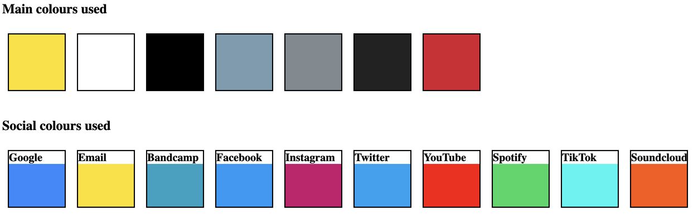
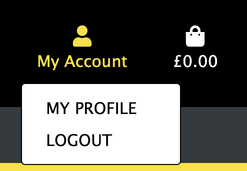
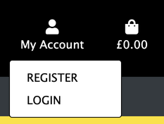
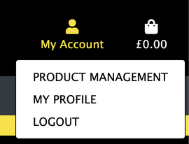
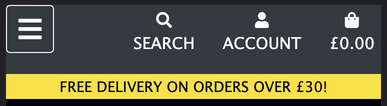
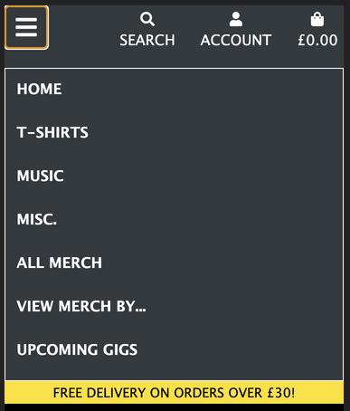

# Lead Shot Hazard

[Here is a link to the final project](https://ms4-lead-shot-hazard.herokuapp.com/homepage)

This site is a merchandise and music e-commerce site for the band Lead Shot Hazard, a ska punk band from West London. This site is fully responsive on all modern screen sizes, and it allowed the band to easily add, edit or delete their merch and music that they have to sell.

This site was built using HTML, CSS, JavaScript, jQuery, Python, Django, and it uses a SQL database through PostgreSQL.

## Contents

* [Icon Key](#icon-key)

* [User Experience (UX)](#user-experience-(ux))
    * [Initial Discussion](#initial-discussion)
    * [User Stories](#user-stories)
    * [Project goals](#project-goals)

* [Design](#design)
    * [Color Scheme](#color-scheme)
    * [Typography](#typography)
    * [Imagery](#imagery)
    * [Wireframes](#wireframes)
    * [Features](#features)
    * [Future Features](#future-features)
    * [Audio](#audio)
    * [Navigation bar](#navigation-bar)

* [Database Design](#database-design)

* [Technologies Used](#technologies-used)
    * [Languages](#languages)
    * [Workspace](#workspace)
    * [Version Control](#version-control)
    * [Wireframing](#wireframing)
    * [Responsive Design](#responsive-design)
    * [Documentation](#documentation)
    * [Site Design](#site-design)
    * [Database Design](#database-design)
    * [Frameworks, Libraries and Others](#frameworks-libraries-and-others)

* [Deployment](#deployment)
    * [Initial Deployment](#initial-deployment)
    * [How to Fork it](#how-to-fork-it)
    * [Making a Local Clone](#making-a-local-clone)

* [Testing](#testing)
    * [W3C Validator](#w3c-validator)
    * [Testing User Stories](#testing-user-stories)
    * [Full Testing](#full-testing)
    * [Solved Bugs](#solved-bugs)
    * [Known Bugs](#known-bugs)
    * [Lighthouse](#lighthouse)
        * [Performance](#performance)
        * [Accessibility](#accessibility)
        * [Best Practices](#best-practices)
        * [SEO](#seo)

* [Credits](#credits)
    * [Code](#code)
    * [Content](#content)
    * [Media](#media)
    * [Acknowledgements](#acknowledgements)

---

## Icon key

&#128272; <-- Superuser only access

&#128100; <-- Logged In Only

&#128683; <-- Logged Out only

&#9989; <-- Yes / Visible

&#10060; <-- No / Not visible

---

## User Experience (UX)
### Initial Discussion
* I wanted to create a website linked to a database, which allows users to login, search for and find merchandise and music.
* This is something that Lead Shot Hazard has been discussing for a while, but we haven't had time to create until now.
* I wanted the band to be able to add, edit and delete items of merchandise and music for sale.

### User Stories
#### Business Goals
As a band member, this site should :
* Sell merchandise and music.
* Match the design and personality of the band.
* Offer a website that is easy to navigate and free of confusion.
* Become another source of revenue for the band.
* Become a platform where fans can follow the future gigs of the band.

#### First Time Visitor Goals
As a first time visitor to this site, a user should be able to :
* Easily navigate the site.
* Intuitively and easily understand what to do.
* Create an account for future purchases.
* Search for a specific product and it's information.
* Browse through all merch.
* Buy products online as a guest.
* Get visual feedback when an action on the site is completed.
* Receive a confirmation email with all relevant information.
* Contact the band through the website.
* View full product information.
* Add or remove items from the shopping bag.
* Add multiple items to the shopping bag.
* Receive an update of the shopping bag when the user performs an action.
* Purchase products securely through Stripe.

#### Returning Visitor Goals
In addition to the First Time Visitor Goals, a Returning Visitor should be able to :
* Log in / out.
* Be confident that the user's password is be stored securely.
* Navigate intuitively, with no need to use the browser's back button.
* Create, update or delete the user's personal information.
* See a history of the user's previous purchases.

#### Admin Goals
In addition to the First Time and Returning Visitor Goals, as an administrator of this site, an admin user should be able to :
* Be confident that a user can't to brute force their way into the restricted pages.
* Edit any product.
* Delete any product.
* Add a new product.
* Create a stock of products to be sold online and keep track of the sales as a superuser.

MAYBE CONSIDER A TABLE AS WELL? USER STORY ID, AS A/AN, I WANT TO BE ABLE TO, SO THAT I CAN. THEN CAN HAVE A TABLE IN TESTING JUST REFERENCING THE IDS
SCOPE???? MORE DETAILED BREAKDOWN OF SCOPE WOULD BE GOOD

### Project Goals
* The main goal is to create an easily editable merchandise site for Lead Shot Hazard, so it takes very little time to keep up to date with their constantly changing merchandise and music selection.
* This project also demonstrates my understanding of maintaining a database attached to a website, with full CRUD (Create, Read, Update and Delete) functionality.

---

## Design
### Color Scheme
* The main colors used in this site are black, white, and yellow.
* These are the colors in the band's logo, and they permeate through the site.
* Other colors are used, such as in the social media icons.
* These colors were used for the band to signify the ray of hope for a society that needs help, which is a popular ideology in the punk scene, and links with the band's song lyrics.

### Typography
* LOGO FONT, TEXT FONT, WHY USED
* I have used a font from [Google Fonts](https://fonts.google.com/), called [FONT NAME](LINK).

### Imagery
* The images used in this project are all photos of the band Lead Shot Hazard, their merchandise, or their logo.
* These have been used to create a strong link between the band and the website, ensuring that all visitors can tell at first glance that this site is for Lead Shot Hazard.
BOX SHADOW, GRADIENTS, UNDERLINED LINKS, BUTTONS, ICONS

### Wireframes
* [Wireframes for desktop, mobile and tablet for this project](static/docs/wireframes.pdf).
* [Database schema for this project](static/docs/database.pdf).
INCLUDE ANY EDITS FROM THE WIREFRAMES TO THE FINISHED SITE

### Features
MAYBE USER DROPDOWNS TO SHOW APPLICABLE USER STORIES IDS AND THE LIKE???
PROFILE - ALLAUTH, EXPLANATION OF DETAILS
RESPONSIVE DESIGN, MAJOR SCREEN SIZES 'ALL FUNCTIONALITY AND STYLING MAINTAINED FROM 320PX AND UP'

#### Create and Delete a profile
* This feature allows the user to :
    * Register for an account with email address, username and password.
    * Ensure no typos by entering the password twice, with the site checking to confirm that the passwords match.
    * Ensure the correct email address by sending a verification email to the email address the user has supplied.
    * Store their details for a faster checkout.
    * Keep a record of their full order history.
    * Delete their profile if they no longer want their details to be stored on the site.

#### Products
* This feature allows the user to :
    * View all products on the website.
    * Perform a keyword search for products by name and description.
    * Browse products by category through the main navigation bar.
    * Sort products alphabetically or by price.
    * Click on a product to view the full product details, including :
        * Name
        * Category
        * Price
        * Image
        * Description
        * Sizes (if relevant)
    * &#128272; Edit or delete any product.
    * &#128272; Add a new product, including an image by either URL or by uploading directly from the superuser's computer.

#### &#128272; Create, Edit and Delete merchandise
* DESCRIBE

#### &#128272; Confirm to delete modal
* This feature allows the user to :
    * Confirm deletion of a product.
    * Avoid accidentally deleting a product.

#### Shopping bag
* This feature allows the user to :
    * Add products to the shopping bag.
    * Adjust the quantity of products in the shopping bag.
    * Delete products in the shopping bag.
    * View the grand total and details in the bag.
* When a product is added, a preview of the shopping bag is displayed in a message.
* The grand total and shipping price are updated when any edits to the shopping bag are made.

#### Checkout
* This feature allows the user to :
    * Checkout as a guest.
    * Safely and securely buy the items in their shopping bag through Stripe.
* &#128100;
    * The shipping details will be filled from any details given in the user profile.
    * The user can select the 'Remember my details' checkbox in the checkout form to save their latest details. This is helpful when :
        * No details are saved in the user's profile.
        * Any of the user's details have changed from what is saved in their profile.
* The card details form is connected to Stripe, a payment platform. This ensures a fully secure payment.
* When the user confirms checkout, an animated loading screen shows whilst the payment details are checked by Stripe.

#### Payment
* If the payment fails :
    * The user is directed back to the checkout form.
    * The user is shown a message that the payment failed.
* If the payment succeeds :
    * The user will be sent a confirmation email.
    * The email contains the order details and order number.
    * The user will be redirected to the checkout success page.
    * A message will display, informing the user that the payment succeeded, containing of the order details and order number.

#### Navigation bar
The navigation bar changes depending on user status and screen size:

| Nav Link | &#128683; | &#128100; | &#128272; |
|-------|-----|-----|-----|
| Logo (Homepage) | &#9989; | &#9989; | &#9989; |
| Home | &#9989; | &#9989; | &#9989; |
| Products | &#9989; | &#9989; | &#9989; |
| Product Details | &#9989; | &#9989; | &#9989; |
| Profile | &#10060; | &#9989; | &#9989; |
| Log Out | &#10060; | &#9989; | &#9989; |
| Log In | &#9989; | &#10060; | &#10060; |
| Register | &#9989; | &#10060; | &#10060; |

* Logged in

* Logged out

* An admin

* On small screen sizes

#### Auto-updating copyright year
* The copyright year auto-updates to the current year.

#### SCREEN RECORD ANY ANIMATION, SAVE AS A GIF
* DESCRIBE

### Future Features
* ADD FUTURE FEATURES
Add to bag button is disabled if the product is out of stock.
Recommended product at the bottom of checkout
Retrieve password? Or re-set password?

### Audio
* All audio is owned by the band Lead Shot Hazard.

### Defensive Design
* FORM VALIDATION
* ADDING TOO MANY / TOO LITTLE PRODUCTS TO BAG
* WHEN AN ACTION IS COMPLETED
* DEFAULT IMAGE IF IMAGE IS BROKEN / NO IMAGE
* CUSTOM ERROR PAGES - 404
* WEBHOOKS?

---

## Database Design
INFO HERE

---

## Technologies Used
### Languages Used
#### HTML
* [HTML5](https://developer.mozilla.org/en-US/docs/Web/Guide/HTML/HTML5)

#### CSS
* [CSS3](https://developer.mozilla.org/en-US/docs/Archive/CSS3#:~:text=CSS3%20is%20the%20latest%20evolution,flexible%20box%20or%20grid%20layouts.)

#### JavaScript
* [JavaScript](https://developer.mozilla.org/en-US/docs/Web/JavaScript)
* This project uses JavaScript ES6.
The project uses jQuery, a JavaScript library, for DOM Traversal, HTML Manipulation, and Event Handling.

#### Python
* [Python](https://www.python.org/)
* VERSION

### Workspace
#### GitPod:
[GitPod](https://gitpod.io/) was used as a virtual IDE workspace to build this site.

### Version Control
#### Git:
[Git](https://git-scm.com/) was used for version control by utilizing the Gitpod terminal to add and commit to Git and push to GitHub.
#### GitHub:
[GitHub](https://github.com/) is used to store the code for this project after being pushed from Git.

### Wireframing
#### Balsamiq:
[Balsamiq](https://balsamiq.com/) was used to create the wireframes during the design process.

### Responsive Design
#### Am I Responsive Design:
[Am I Responsive Design](http://ami.responsivedesign.is/#) was used to check the responsive design of the site, and to create the final site image.
#### Responsinator:
[Responsinator](http://www.responsinator.com/) was used to help improve the responsive design on a variety of devices.

### Documentation
#### Shields.io:
[Shields.io](https://shields.io/) was used to create the GitHub badges for the top of this README.md file.

### Site Design
#### Font Awesome:
[Font Awesome](https://fontawesome.com/) was used on all pages to add the icons.
#### Google Fonts:
[Google Fonts](https://fonts.google.com/) was used to select all the fonts on the site.
#### Favicon.io:
[favicon.io](https://favicon.io/) used to create a site favicon.
#### AWS S3 Bucket:
[AWS S3 Bucket](LINK) was used to host images for this site.

### Database Design
#### DATABASE INFO

### Packages
TABLE WITH NAME, PURPOSE
Django
Flake-8
Pylint
django-allauth
Stripe
Boto3
Django-storages
gunicorn
django-crispy-forms
dj-database-url
psycopg2-binary
coverage?
pylint-django?
pillow? 

### Hosting
#### Heroku:
[Heroku](https://www.heroku.com) was used to deploy the live site.
#### AWS S3
[AWS S3 Bucket](LINK) was used to host this project's images.

### Frameworks, Libraries and Others
#### Google DevTools:
[Google DevTools](https://developer.chrome.com/docs/devtools/) was used to help find what code correlated to which feature.
#### Lighthouse:
[Lighthouse](https://developers.google.com/web/tools/lighthouse) was used to ensure that the code was as performant as possible, confirming to best practices, and SEO and Accessibility guidelines.
#### Flask:
[Flask](https://flask.palletsprojects.com/en/2.0.x/) was used to help create the templating for this site.
#### Materialize:
[Materialize](https://materializecss.com/) was used to create a beautiful, responsive website.
#### jQuery:
[jQuery](https://jquery.com/), a JavaScript library was used for DOM traversal, HTML manipulation, and event handling.
#### stripe.js
[Stripe.js](LINK) library was used for handling Stripe payment objects.
#### RandomKeygen:
[RandomKeygen](https://randomkeygen.com/) was used to generate a strong `SECRET_KEY`.
#### pip:
[pip](https://pip.pypa.io/en/stable/) was used to install the required dependancies for this site.

---

## Deployment
### Requirements for Deployment
* Python
* AWS S3 account
* GitHub account
* Heroku account

### Initial Deployment

SECRET_KEY - This is a custom string set up to keep sessions secure. I recommend using a 'Fork Knox' level password generated by [RandomKeygen](https://randomkeygen.com/).

This site was deployed to Heroku by following these steps:

1. Heroku needs to be told what the requirements are for this project, so go into your GitPod terminal, and create files to explain the requirements by using the following commands:
    * `pip3 freeze --local > requirements.txt`
    * `echo web: python run.py > Procfile` - Ensure there is no blank line after the contents of this file
2. Push these changes to your repository.
6. Login or sign up to [Heroku](https://www.heroku.com).
7. Select 'Create New App' in the top right of your dashboard.
8. Choose a unique app name, and select the region closest to you, before clicking 'Create App'.
9. Go to the 'Deploy' tab, find 'Deployment Method' and select 'GitHub'.
10. Search to find your GitHub repository, and click 'Connect'. Don't enable automatic deployment yet, as this can cause errors.
11. Go to the 'Settings' tab, find 'Config Vars', and click 'Reveal Config Vars'.
12. Enter key value pairs that match those in your env.py file, displayed like this :

| Key | Value |
|---|---|
| SECRET_KEY | ## YOUR SECRET_KEY ## |

13. Go to the 'Deploy' tab, and click 'Enable Automatic Deployment'.
14. In 'Manual Deploy', choose which branch you'd like to deploy from (I chose 'master' branch, this is also known as 'main').
15. Click 'Deploy Branch' to deploy your app onto the Heroku servers.
16. Once the app has finished building, click 'Open App' to open your site.

### How to Fork it
1. Login or Sign Up to [GitHub](www.github.com).
2. On GitHub, go to [Abibubble/ms4-lead-shot-hazard](https://github.com/Abibubble/ms4-lead-shot-hazard).
3. In the top right, click "Fork".
4. You will need to create an env.py file with your own values, and create a MongoDB database with the data keys and types as shown above.
5. You will also need to install all of the project requirements. This can be done using the command `pip3 install -r requirements.txt`.
6. Type `python3 manage.py runserver` in your GitPod terminal to run your local site of this project.

### Making a Local Clone
1. Log in to [GitHub](https://www.github.com) and locate the [Repository](https://github.com/Abibubble/ms4-lead-shot-hazard) for this site.
2. Under the repository name, above the list of files, click "Code".
3. Here you can either Clone or Download the repository.
4. You should clone the repository using HTTPS, clicking on the icon to copy the link.
5. Open Git Bash.
6. Change the current working directory to the new location, where you want the cloned directory to be.
6. Type `git clone`, and then paste the URL that was copied in Step 4.
7. Press Enter, and your local clone will be created.
8. You will need to create an env.py file with your own values, and create a MongoDB database with the data keys and types as shown above.
9. You will also need to install all of the project requirements. This can be done using the command `pip3 install -r requirements.txt`.
10. Type `python3 app.py` in your GitPod terminal to run your local site of this project.

For a more detailed version of these steps, go to the [Github Docs](https://docs.github.com/en/github/creating-cloning-and-archiving-repositories/cloning-a-repository#cloning-a-repository-to-github-desktop) page on this topic.

---

## Testing
### Testing technologies
The project's HTML was validated using W3C HTML Markup Validator.
The project's CSS was validated using W3C Jigsaw CSS Validator.
The project's JS was validated using JSHint.
The project’s Python was validated using Pylint.
The project's accessibility was assessed via WebAim's W.A.V.E and Contrast Checker and Google Chrome's Lighthouse.
The project used Toptal's Colorfilter to assess how colour-blind-friendly the site was.
The project was Unit Tested using django’s testing tools.

### W3C Validator
W3C Markup Validator, W3C CSS Validator, JSHint, and PEP8 Online were used to validate the project to ensure there were no syntax errors within the site.

1. W3C HTML Markup Validator
    * [Homepage](LINK)
    * Unfortunately, as it's not possible to log in using the Validator, it was only possible to test the pages available to a user who isn't logged in.

2. W3C CSS Validator
    * [Homepage](LINK)
    * Unfortunately, as it's not possible to log in using the Validator, it was only possible to test the pages available to a user who isn't logged in.

3. JSHint
    * [JSHint](https://jshint.com/)
    * Explanations

4. PEP8 Online
    * [PEP8 Online](http://pep8online.com/)

### Testing User Stories
#### First Time Visitor Goals
##### Goal
* How

#### Returning Visitor Goals
##### Goal
* How

#### Admin Goals
##### Goal
* How

### Full Testing
[Click here to view the full testing steps](static/docs/TESTING.md) that were completed on every device and browser, and screenshots of testing.

### Solved Bugs
1. Bug
    * Bug fix steps

### Known Bugs
* None found, if any errors are found, please contact me via my GitHub ([Abibubble](https://github.com/Abibubble/)) to get them fixed.

### Lighthouse
I tested my website using DevTools Lighthouse feature, and got these results:

#### Desktop

#### Mobile

#### Performance:
* 

#### Accessibility:
* 

#### Best Practices:
* 

#### SEO:
* 

---

## Credits
### Code
* [Font Awesome](https://fontawesome.com/): Library of icons used for social media and download links.

### Content
* All content was created by [Abi Harrison](https://github.com/Abibubble).

### Media
* 

### Acknowledgements
* My mentor, Antonio Rodriguez, at [Code Institute](https://codeinstitute.net/), for continuous helpful feedback and support.
* [Eve Crabb](https://github.com/evecrabb), for her support through my learning, for being a sounding board for bug fixes, and for being the best boss ever.
* The team at [Code Institute](https://codeinstitute.net/), for teaching me the necessary skills to create this site.
* Conor Nye for his continuous support throughout my coding journey.