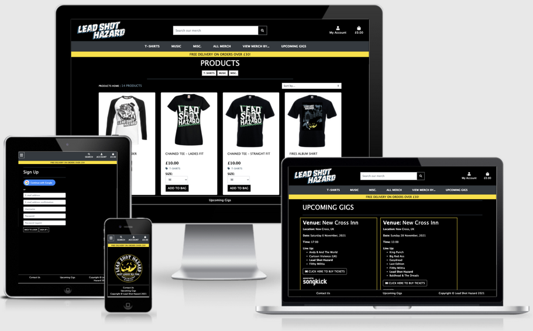
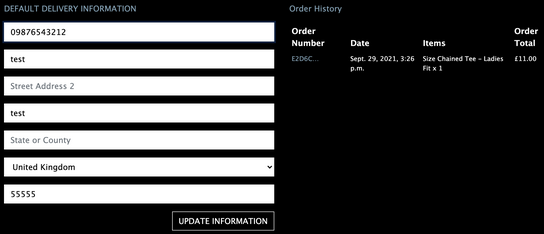
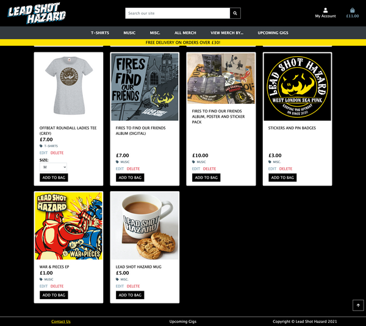
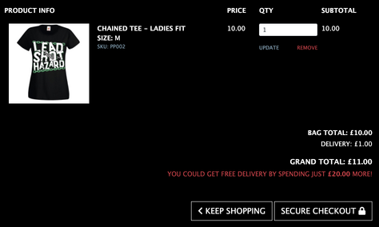
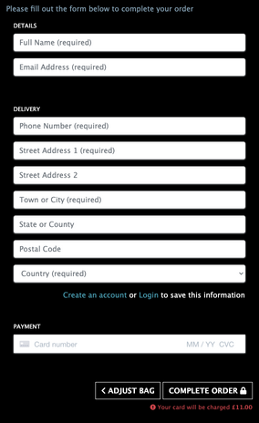
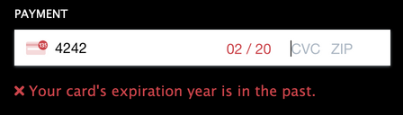
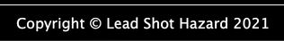
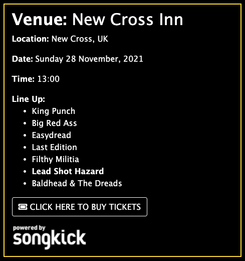
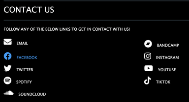

# Lead Shot Hazard

[Here is a link to the final project](https://ms4-lead-shot-hazard.herokuapp.com/)

This site is a merchandise and music e-commerce site for the band Lead Shot Hazard, a ska punk band from West London. This site is fully responsive on all modern screen sizes, and it allows the band to easily add, edit or delete the merchandise and music that they have to sell.

This site was built using HTML, CSS, Bootstrap, JavaScript, jQuery, Python, Django, and it uses a SQL database through PostgreSQL.

## Contents

* [Icon Key](#icon-key)

* [User Experience](#user-experience)
  * [Initial Discussion](#initial-discussion)
  * [User Stories](#user-stories)
  * [Project goals](#project-goals)

* [Design](#design)
  * [Color Scheme](#color-scheme)
  * [Typography](#typography)
  * [Imagery](#imagery)
  * [Wireframes](#wireframes)
  * [Features](#features)
  * [Future Features](#future-features)
  * [Audio](#audio)
  * [Navigation bar](#navigation-bar)

* [Database Design](#database-design)

* [Technologies Used](#technologies-used)
  * [Languages](#languages)
  * [Workspace](#workspace)
  * [Version Control](#version-control)
  * [Wireframing](#wireframing)
  * [Responsive Design](#responsive-design)
  * [Documentation](#documentation)
  * [Site Design](#site-design)
  * [Database Design](#database-design)
  * [Frameworks, Libraries and Others](#frameworks-libraries-and-others)

* [Deployment](#deployment)

* [Testing](#testing)
  * [Solved Bugs](#solved-bugs)
  * [Known Bugs](#known-bugs)

* [Credits](#credits)
  * [Code](#code)
  * [Content](#content)
  * [Media](#media)
  * [Acknowledgements](#acknowledgements)

---

## Icon key

&#128272; <-- Superuser only access

&#128100; <-- Logged In Only

&#128683; <-- Logged Out only

&#9989; <-- Yes / Visible

&#10060; <-- No / Not visible

[Back to the top](#lead-shot-hazard)

---

## User Experience

### Initial Discussion

* I wanted to create a website linked to a database, which allows users to log in, search for, and find merchandise and music.
* This is something that Lead Shot Hazard has been discussing for a while, but hasn't had time to create until now.
* I wanted the band to be able to add, edit and delete items of merchandise and music for sale.

### User Stories

| **User Story Id** | **As a / an...** | **I should be able to...** | **So that I can...** |
| --- | --- | --- | --- |
||| **Overall** ||
| A1 | Band member | Sell merchandise and music | Have an online form of income |
| A2 | Band member | Match the design and personality of the band with that of the site | Easily show fans that this site is linked to the band |
| A3 | Band member | Offer a website that is easy to navigate and free of confusion | Avoid the stress of fans needing more assistance than necessary |
| A4 | Band member | Have another source of revenue for the band | Spend more time making music |
| A5 | Band member | Have a platform where fans can follow the future gigs of the band | Ensure our fans know when and where our upcoming gigs are |
||| **Viewing & Navigation** ||
| B1 | Shopper | Easily navigate the site | Have a good user experience |
| B2 | Shopper | View all products | Choose some to buy |
| B3 | Shopper | Search for a specific product and its information | Find the item that I want |
| B4 | Shopper | View a specific type of product | Quickly find items I'm interested in |
| B5 | Shopper | View full product information | See the details of a specific product including price, description, image, and sizes |
| B6 | Shopper | Easily see my bag total | Stick to a budget |
| B7 | Shopper | Get visual feedback when an action on the site is completed | Easily see when an action has been completed |
| B9 | Shopper | Contact the band through the website | Ask questions |
||| **Registration & User Accounts** ||
| C1 | Site User | Create an account for future purchases | View my order history or checkout quicker |
| C2 | Site User | Log In | Access my account |
| C3 | Site User | Log Out | Keep my account private on a shared device |
| C4 | Site User | Get an email confirmation after registering | Verify my registration was successful |
| C5 | Site User | See a history of my previous purchases | Check what I have bought before |
| C6 | Site User | Create, update or delete my personal information | Always have up-to-date personal information |
||| **Sorting & Searching** ||
| D1 | Shopper | Sort the available products | Sort alphabetically or by price |
| D2 | Shopper | Sort a category of products | Sort relevant products alphabetically or by price |
| D3 | Shopper | Search for a specific product by name or description | Quickly find items I'm interested in |
| D4 | Shopper | View a specific type of product | Quickly find items I'm interested in |
| D5 | Shopper | Easily see what I've searched, and the total number of results | Decide whether the product I'm looking for is available |
||| **Purchasing & Checkout** ||
| E1 | Shopper | Buy products online as a guest | Checkout without having to create an account |
| E2 | Shopper | Easily add, update the quantity, or delete products in my bag | Adjust my purchase to fit my budget or personal choice |
| E5 | Shopper | Receive an update of the shopping bag when I perform an action | Be aware of the status of my shopping bag |
| E4 | Shopper | View details about items in my bag | Decide if I want to purchase an item |
| E4 | Shopper | Revisit my shopping bag after logging out and in | Continue my purchase |
| E6 | Shopper | Purchase products securely on the site | Be confident that my card and personal details are safe |
| E2 | Shopper | Receive a confirmation email with information of my order | View my order details |
||| **Product Management** ||
| F1 | Site Owner | Edit any product | Update details of products |
| F2 | Site Owner | Delete any product | Remove old products from the site |
| F3 | Site Owner | Add a new product | Add new products to the site |
||| **Authentication & Security** ||
| G1 | Site User | Verify my email address | Ensure my account is set up securely |
| G2 | Site User | Be confident that my password is stored securely | Feel safe from malicious activity |
| G3 | Site Owner | Be confident of the security of the restricted pages | Feel safe from malicious activity |

### Project Goals

* The main goal is to create an easily editable merchandise site for Lead Shot Hazard, so it takes very little time to keep up to date with their constantly changing merchandise and music selection.
* This project also demonstrates my understanding of maintaining a database attached to a website, with full CRUD (Create, Read, Update and Delete) functionality, using a PostgreSQL database, and Amazon Web Services.

[Back to the top](#lead-shot-hazard)

---

## Design

### Color Scheme

* The main colors used in this site are black, white, and yellow.
* These main colors are the colors in the band's logo, and they permeate through the site.
* These colors were used by the band to signify the ray of hope for a society that needs help, which is a popular ideology in the punk scene, and links with the band's song lyrics.
* A slightly dark red has been used for all Delete buttons, to signify that this is a destructive action.
* Two grey colors have been used for tags on the site, one slightly darker than the other to maintain AAA color contrast compliance.
* Different colors have also been used on the hover state of the social media icons on the Contact Us page.
* The social media icon colors have been taken directly from each external website's logo, to reference where the link would take them.

### Typography

* For the font, I decided to stick with the standard HTML font family. As they're sans-serif fonts, they are easy to read for dyslexic and partially visually impaired users.
* As the standard HTML font size is 16px, I kept it at that, ensuring to not have any fonts smaller than that, to aid visually impaired users.
* Also, the recommended smallest font size for accessible websites is 12px, so by keeping all font sizes at the HTML standard of 16px or above, I ensured to be fully compliant with the [Penn State University Accessibility and Usability Guidelines](https://accessibility.psu.edu/fontsizehtml/).
* Font sizes are also able to be zoomed to 200% without losing contrast or functionality, to comply with the [WCAG Guidelines on fonts](https://www.w3.org/TR/UNDERSTANDING-WCAG20/visual-audio-contrast-scale.html).
* A lot of the text on the website, including all headers and buttons, has been transformed to uppercase, to link with the strong and bold feel of the site.
* This also connects the site to the band's logos, which all use uppercase text.
* Lowercase text has been used in some places to avoid the site feeling aggressive.

### Imagery

* The images used in this project are all photos of the band Lead Shot Hazard, their merchandise, or their logo.
* These have been used to create a strong link between the band and the website, ensuring that all visitors can tell at first glance that this site is for Lead Shot Hazard.
* As I am a member of Lead Shot Hazard, I own joint rights to use all images and designs that the band has created.
* No box shadows or gradients have been used, to link with the styling of the Lead Shot Hazard graphics, which use strong, bold colors with harsh lines.
* All links have their underlines removed for stylistic purposes. The links in the footer re-gain their underlines when they're hovered over or focused on.
* All interactable objects have hover and focus styles applied to make it clear to the user that those objects are interactable.
* Icons from [Font Awesome](https://fontawesome.com/) have been used throughout the site to add meaning where relevant. These icons also have text either visible or in aria labels where required.
* Button and link colors have been used to convey meaning, mainly in the use of the color red to convey 'Delete' or 'Cancel' as dangerous actions.

### Wireframes

* [Wireframes for desktop, mobile, and tablet for this project](static/docs/wireframes.pdf).
* [Database schema for this project](static/docs/database.pdf).

### Features

#### Create a user profile

* This feature allows the user to:
  * Register for an account with an email address, username, and password.
  * Ensure no typos by entering the password twice, with the site checking to confirm that the passwords match.
  * Ensure no typos by entering the email twice, with the site checking to confirm that the emails match.
  * Ensure the correct email address by sending a verification email to the email address the user has supplied.
  * &#128100; Store their details for faster checkout.
  * &#128100; Keep a record of their full order history.

#### Products

* This feature allows the user to:
  * View all products on the website.
  * Perform a keyword search for products by name and description.
  * Browse products by category through the main navigation bar.
  * Sort products
    * Alphabetically (A-Z)
    * Alphabetically (Z-A)
    * By price (low to high)
    * By price (high to low)
  * Click the 'Add to Bag' button for a faster shopping experience, including the ability to choose a size on products with sizes.
  * Click on a product card to view the full product details, including:
    * Name
    * Category
    * Price
    * Image
    * Description
    * Audio (if relevant)
    * Sizes (if relevant)
  * Click the back to top arrow button to return to the top of the page.

#### &#128272; Create, Edit and Delete products

* This feature allows the superuser to:
  * Add a new product to the store.
  * Edit an existing product.
  * Delete an existing product.
  * Include images, either by URL or by uploading directly from the superuser's computer.
  * Include audio, by uploading directly from the superuser's computer.

#### Confirm to delete modal

* This feature allows the user to:
  * &#128272; Confirm deletion of a product.
  * &#128272; Avoid accidentally deleting a product.

#### Shopping bag

* This feature allows the user to:
  * Add products to the shopping bag.
  * Adjust the quantity of products in the shopping bag.
  * Delete products in the shopping bag.
  * View the grand total and details in the bag.
* When a product is updated, a preview of the shopping bag is displayed in a message.
* The grand total and shipping price are updated when any edits to the shopping bag are made.
* Updating a product quantity to 0 in the shopping bag removes the item from the shopping bag.

#### Checkout

* This feature allows the user to:
  * Check out as a guest.
  * Safely and securely buy the items in their shopping bag through Stripe.
  * &#128100; The shipping details will be filled from any details given in the user profile.
  * &#128100; The user can select the 'Remember my details' checkbox in the checkout form to save their latest details. This is helpful when:
    * No details are currently saved in the user's profile, and the user wishes to save their details.
    * Any of the user's details have changed from what is saved in their profile.
* The card details form is connected to Stripe, a payment platform. This ensures a fully secure payment.
* When the user confirms checkout, an animated loading screen shows whilst the payment details are checked by Stripe.

#### Payment

* If the payment fails:
  * The user is directed back to the checkout form.
  * The user is shown a message that the payment failed.
* If the payment succeeds:
  * The user will be sent a confirmation email.
  * The email contains the full order details and order number.
  * The user will be redirected to the checkout success page.
  * A message will display, informing the user that the payment succeeded, containing the order details and order number.
  * &#128100; The order will be added to the user's order history in their profile.

#### Navigation bar

The navigation bar changes depending on user status and screen size:

| Nav Link | &#128683; | &#128100; | &#128272; |
|-------|-----|-----|-----|
| Logo (Homepage) | &#9989; | &#9989; | &#9989; |
| Home | &#9989; | &#9989; | &#9989; |
| Products | &#9989; | &#9989; | &#9989; |
| Product Details | &#9989; | &#9989; | &#9989; |
| Contact Us | &#9989; | &#9989; | &#9989; |
| Upcoming Gigs | &#9989; | &#9989; | &#9989; |
| Product Management | &#10060; | &#10060; | &#9989; |
| Profile | &#10060; | &#9989; | &#9989; |
| Log Out | &#10060; | &#9989; | &#9989; |
| Log In | &#9989; | &#10060; | &#10060; |
| Register | &#9989; | &#10060; | &#10060; |

* Navigation bar

* Logged in

* Logged out

* An admin

* On small screen sizes

#### Auto-updating copyright year

* The copyright year auto-updates to the current year.

#### Gigs feed

* On the Upcoming Gigs page, the upcoming gigs will automatically update.
  * This has been connected to the [Songkick API](https://www.songkick.com/developer), which is updated by either the band, the venue, or the promoter each time a new gig is booked.
  * The Upcoming Gigs page will then take this data automatically and display it clearly on the page for users to see.
  * This allows users to keep up with when and where the band will be performing in the future.
  * The data has been formatted for ease of reading for the user.
  * The date data uses the [calendar](https://docs.python.org/3/library/calendar.html) Python module to get the day of the week that the gig falls on, as well as displaying the date in a user-friendly way.
  * There is also a link to the Songkick webpage for each gig, which allows the user to purchase tickets for a specific gig.

#### Contact section

* This feature allows the user to:
  * Contact the band via email for queries about merchandise or upcoming gigs.
  * Navigate to any of the band's social media pages.
  * It also has a customised hover feature, where when the user hovers over each link, the link becomes the main color of the site that it is linking to.

### Future Features

* Stock count for each product size, including out-of-stock sizes.
* Add to bag button is disabled if the product is out of stock.
* Recommended products at the bottom of the checkout page.
* Retrieve or reset a forgotten password.
* Social media login via Facebook.
* Special offers.
* Regex or number validation on phone number fields.

### Audio

* All audio is owned by the band Lead Shot Hazard.
* As I am a member of Lead Shot Hazard, I own joint rights to use all audio that the band has created.
* The audio that is available on the individual product details pages has been trimmed down to approximately 30 seconds, to allow the user to hear a sample of the band's music, without being able to listen to the entire song for free.

### Defensive Design

* Form validation
  * This has been used on every form input on the site to ensure the correct data is added.
  * If incorrect data is added, red warning text appears, to instruct the user on how to fix the error.
  * Image file uploads are validated by [Django's ImageField](https://docs.djangoproject.com/en/3.2/ref/models/fields/#imagefield), to ensure that the images that are uploaded are genuine images, and aren't malicious.
  * Audio file uploads are validated by [python-magic](https://pypi.org/project/python-magic/), to ensure that the audio files that are uploaded are genuine audio files, and aren't malicious.
* Adding products to the bag
  * Custom validation has been added to ensure that users can't:
    * Add less than one of a product into their bag (such as adding a 0 quantity of a product).
    * Add more than 50 of a product into their bag.
* Messages when an action is completed
  * A message will appear in the top right of the screen when the following actions are completed:
    * The user adds a product to their shopping bag.
    * The user removes a product from their shopping bag.
    * The user edits the quantity of a product in their shopping bag.
    * A payment succeeds.
    * A payment fails.
    * An error occurs.
    * &#128100; A user updates their profile information.
    * &#128272; A superuser adds a new product.
    * &#128272; A superuser edits a product.
    * &#128272; A superuser deletes a product.
* Default image
  * A default image will display if there is no image added.
  * A default image will display if the image link has broken.
* Custom error pages
  * A custom 404 error page will show if the user attempts to visit a page that doesn't exist.
  * A custom 500 error page will show if an internal server error occurs.
* Webhooks
  * Webhooks form a notification system for every secure action on your site (most notably, payment intents).
  * Webhooks return an event object, containing all the relevant information about the action, including the type of action, and the data associated with it.
  * If the user leaves the page before the order is complete but the payment goes through, the billing details and shipping address will be sent with the payment and can be accessed via the webhooks.
* Login validation
  * The `@login_required` decorator has been used to ensure that the restricted pages are secure.
  * If a logged-out user tries to access a restricted page, they will be redirected to the login page.
  * If a logged-in user without access rights tries to access a restricted page, it redirects them to the homepage, and presents them with a message saying 'You do not have access to this page'.

[Back to the top](#lead-shot-hazard)

---

## Database Design

This database uses a SQL database through PostgreSQL. They were originally built in JSON files, [which can be found here](products/fixtures).

### Categories Database

### Products Database

[Back to the top](#lead-shot-hazard)

---

## Technologies Used

### Languages Used

#### HTML

* [HTML5](https://developer.mozilla.org/en-US/docs/Web/Guide/HTML/HTML5)

#### CSS

* [CSS3](https://developer.mozilla.org/en-US/docs/Archive/CSS3#:~:text=CSS3%20is%20the%20latest%20evolution,flexible%20box%20or%20grid%20layouts.)

#### JavaScript

* [JavaScript](https://developer.mozilla.org/en-US/docs/Web/JavaScript)
* This project uses JavaScript ES6 and jQuery.

#### Python

* [Python](https://www.python.org/)
* This project uses Python 3.8.11.

### Workspace

#### GitPod

[GitPod](https://gitpod.io/) was used as a virtual IDE workspace to build this site.

### Version Control

#### Git

[Git](https://git-scm.com/) was used for version control by utilizing the Gitpod terminal to add and commit to Git and push to GitHub.

#### GitHub

[GitHub](https://github.com/) is used to store the code for this project after being pushed from Git.

### Wireframing

#### Balsamiq

[Balsamiq](https://balsamiq.com/) was used to create the wireframes during the design process.

### Responsive Design

#### Am I Responsive Design

[Am I Responsive Design](http://ami.responsivedesign.is/#) was used to check the responsive design of the site, and to create the final site image.

#### Responsinator

[Responsinator](http://www.responsinator.com/) was used to help improve the responsive design on a variety of devices.

### Documentation

#### Shields.io

[Shields.io](https://shields.io/) was used to create the GitHub badges for the top of this README.md file.

#### Carbon

[Carbon](https://carbon.now.sh/) was used to take elegant screenshots of code for this documentation.

#### JSHint extension

[JSHint Extension](https://open-vsx.org/vscode/item?itemName=dbaeumer.jshint) was used on GitPod to maintain code quality at all times.

#### markdownlint extension

[markdownlint Extension](https://open-vsx.org/vscode/item?itemName=DavidAnson.vscode-markdownlint) was used on GitPod to ensure all markdown was correctly formatted.

### Site Design

#### Font Awesome

[Font Awesome](https://fontawesome.com/) was used on all pages to add the icons.

#### Google Fonts

[Google Fonts](https://fonts.google.com/) was used to select all the fonts on the site.

#### Favicon.io

[favicon.io](https://favicon.io/) used to create a site favicon.

#### Audio Trimmer

[Audio Trimmer](https://audiotrimmer.com/) was used to trim the audio down to sample clips.

#### Calendar

[Python calendar module](https://docs.python.org/3/library/calendar.html) was used to display the date of upcoming gigs in a user-friendly format.

### Packages

| Name | Purpose |
|------|---------|
| Django | Framework |
| Flake-8 | Syntax |
| Pylint | Syntax |
| Pillow | Images |
| django-allauth | Authentication |
| Stripe | Secure Payment Services |
| Boto3 | AWS Management |
| django-storages | Custom Storage Backends |
| django-countries | Country Form Field |
| python-magic | Audio Form Field |
| gunicorn | WSGI HTTP Server |
| django-crispy-forms | Front End Form Rendering |
| dj-database-url | Database Configuration |
| psycopg2-binary | PostgreSQL DB Adaptor |
| coverage | Test Coverage |
| travis.ci | Testing |
| | |

### Hosting

#### Heroku

[Heroku](https://www.heroku.com) was used to deploy the live site.

#### Amazon AWS S3

[Amazon AWS S3](https://s3.console.aws.amazon.com/s3) was used to host this project's images and static files.

### Frameworks, Libraries, and Others

#### Google DevTools

[Google DevTools](https://developer.chrome.com/docs/devtools/) was used to help find what code correlated to which feature.

#### Lighthouse

[Lighthouse](https://developers.google.com/web/tools/lighthouse) was used to ensure that the code was as performant as possible, conforming to best practices, and SEO and Accessibility guidelines.

#### WebPageTest

[WebPageTest](https://www.webpagetest.org/) was used to ensure that the code was as performant as possible, conforming to best practices, and SEO and Accessibility guidelines. As it is often more reliable than Lighthouse, this was used near the end of the project to fix any remaining issues.

#### Jinja

[Jinja](https://jinja.palletsprojects.com/en/3.0.x/) was used to help create the templating for this site.

#### Bootstrap

[Bootstrap](https://getbootstrap.com/) was used to create a beautiful, responsive website.

#### jQuery

[jQuery](https://jquery.com/), a JavaScript library was used for DOM traversal, HTML manipulation, and event handling.

#### stripe.js

[Stripe.js](https://stripe.com/docs/js) library was used for handling Stripe payment objects.

#### Djecrety

[Djecrety](https://djecrety.ir/) was used to generate a strong `SECRET_KEY`.

#### pip

[pip](https://pip.pypa.io/en/stable/) was used to install the required dependencies for this site.

#### Slack

[Slack](https://slack.com/intl/en-gb/) was used to communicate with the [Code Institute](https://codeinstitute.net/) community for help and support with bug fixes, and a peer code review.

#### Songkick API

[Songkick API](https://www.songkick.com/developer) was used to populate and auto-update the data of upcoming gigs for the band.

#### python-magic

[python-magic](https://pypi.org/project/python-magic/) was used to validate that the files being uploaded as audio are genuinely audio files, not just validating by file extension.

[Back to the top](#lead-shot-hazard)

---

## Deployment

[Please click here for all Deployment steps and requirements](static/docs/DEPLOYMENT.md).

[Back to the top](#lead-shot-hazard)

---

## Testing

[Click here to view the full testing steps](static/docs/TESTING.md), which were completed on every device and browser, and screenshots of testing.

### Solved Bugs

1. No images are being displayed.
    * I checked my `MEDIA_URL` and `MEDIA_ROOT` in `settings.py` were defined.
    * I looked through the HTML and the project app's `urls.py` for any discrepancies.
    * I searched on the Code Institute Slack channels and Stack Overflow for anyone who had a similar issue but didn't find anything.
    * I then asked on Slack and was prompted to check my use of a tuple in the `settings.py` file.
    * I had set `MEDIA_ROOT = (os.path.join(BASE_DIR, 'media'),)` instead of `MEDIA_ROOT = os.path.join(BASE_DIR, 'media')`.
    * I changed this, which fixed this bug.
2. The Stripe card section of the checkout form wasn't appearing.
    * I checked through my code for typos.
    * I checked through my environment variables, to ensure no variables were missing.
    * I re-set my `STRIPE_WH_SECRET` variable to ensure that it was set correctly.
    * I re-started my Gitpod workspace for the new `STRIPE_WH_SECRET` variable to take effect.
    * Finally, I double-checked my file paths to ensure my script file was being accessed correctly.
    * I had accidentally created my `js` file inside my `css` file, so I moved it into the `static` file, which fixed this bug.
3. `OperationalError at /accounts/login/ no such column: profiles_userprofile.user_id` was occurring when I tried to log in to the site as superuser for the first time.
    * I checked through my code, to see if I'd referenced something incorrectly.
    * I saw that inside the `def __str__` of the `UserProfile` class in `profiles/models.py`, the `self` in `return self.user.username` was showing an `Instance of 'OneToOneField' has no 'username' member` error.
    * I realised I had previously named the variable `default_user` instead of `user`.
    * I ran migrations to update this, which fixed the bug.
4. When I added the `has_audio` and `audio` fields to my products fixture, it wasn't taking effect on my live site.
    * I checked that I'd run `python3 manage.py makemigrations`, `python3 manage.py migrate`, `python3 manage.py loaddata categories`, and `python3 manage.py loaddata products` in GitPod.
    * Everything was correct there, so I checked that I'd updated my `models.py` file to include the new fields.
    * I then asked for advice on the [Code Institute](https://codeinstitute.net/) Slack channel, and [Simen Daehlin](https://github.com/Eventyret) suggested that I hadn't run the above commands in my Heroku CLI as well.
    * I ran the commands in the Heroku CLI, which fixed this issue.
5. Travis CI builds were failing with an output error of `django.core.exceptions.ImproperlyConfigured: The SECRET_KEY setting must not be empty.`.
    * I considered the context in which the error was occurring.
    * I realised this error started happening once I'd deployed my site and moved my environment variables.
    * I looked through the [Travis CI documentation](https://docs.travis-ci.com/user/environment-variables/#defining-encrypted-variables-in-travisyml) and realised I could include a dummy SECRET_KEY in my travis.yml file.
    * I included `SECRET_KEY="whatever" python manage.py test` in my travis.yml file, which fixed this issue.
6. The [Songkick API](https://www.songkick.com/developer) wasn't providing the correct data, and was only providing data up to 2016.
    * I checked that my Songkick API key was being accessed correctly, and that my band ID was correct.
    * I read through the [Songkick API docs](https://www.songkick.com/developer) and checked I was using the correct syntax.
    * I looked at the raw JSON data, and saw at the bottom it said 'page 1, showing 50 items out of 122'.
    * I looked up the correct syntax to display the final page of the data.
    * I realised that the data being provided was only of past gigs, rather than upcoming gigs.
    * I searched in the [Songkick API group](https://groups.google.com/g/songkick-api) and found that I was using the `gigography` rather than `calendar` in the API URL.
    * I changed this, which then provided me with the correct data to populate the Upcoming Gigs page with.
7. [Travis CI](https://www.travis-ci.com/) was failing the Band App tests, despite the Django and coverage tests running successfully.
    * The Travis CI builds were failing with the following error: `File "/home/travis/build/Abibubble/ms4-lead-shot-hazard/band/views.py", line 17, in view_gigs events = result['resultsPage']['results']['event'] KeyError: 'results'`
    * I tried giving the test some test gig data, which still resulted in the same error.
    * I then read through the [Travis CI docs about defining variables](https://docs.travis-ci.com/user/environment-variables/#Defining-Variables-in-Repository-Settings) and found that there is a place in Travis CI to include your environment variables.
    * I added my Songkick API key into the Travis CI environment variables.
    * I re-ran the build, which fixed this bug.

### Known Bugs

* None found, if any errors are found, please contact me via my GitHub ([Abibubble](https://github.com/Abibubble/)) to get them fixed.

[Back to the top](#lead-shot-hazard)

---

## Credits

### Code

* [Font Awesome](https://fontawesome.com/): Library of icons used for social media and download links.
* This website was made with the help of the tutorials from Code institute for the Boutique Ado project by Chris Zielinski. The code has been customised and improved to fit this project.
* [Django Documentation](https://docs.djangoproject.com/en/3.2/) has been used to ensure correct syntax usage throughout the code.
* [Stack Overflow](https://stackoverflow.com/) has been used to help with deciphering the django error codes, and searching for bug fixes.
* [Chris Anstey](https://github.com/ansteychris), a Digital Experience Lead at Google, for the discussion we had about Lighthouse vs WebPageTest.
* I followed [this video from JustDjango](https://www.youtube.com/watch?v=NG48CLLsb1A) to add the Google social login functionality.
* [This stackoverflow post](https://stackoverflow.com/questions/3648421/only-accept-a-certain-file-type-in-filefield-server-side) helped me validate that the audio files being uploaded are genuine audio files.
* [Dave Horrocks](https://github.com/DaveyJH) helped me with working out the logic and syntax for the Songkick API data and the Django testing.

### Content

* All content was created by [Abi Harrison](https://github.com/Abibubble).
* [Click here to view links to all sites I used for research or testing](static/docs/LINKS.md).

### Media

* All media on this site is owned by Lead Shot Hazard.
* As a member of Lead Shot Hazard, I own joint rights to use all media and images of the band.
* The audio selections were cropped down to a sample size using [Audio Trimmer](https://audiotrimmer.com/).
* [Manni Silva](https://github.com/manni8436) helped me by taking the Mobile Safari and Tablet Safari screenshots in the [TESTING.md file](static/docs/TESTING.md).
* The Songkick image on the Upcoming Gigs page was found in the [downloadable ZIP file on this site](https://www.songkick.com/developer/api-terms-of-use), as a requirement for using the Songkick API.

### Acknowledgements

* My mentor, Antonio Rodriguez, at [Code Institute](https://codeinstitute.net/), for continuous helpful feedback and support.
* The team at [Code Institute](https://codeinstitute.net/), for teaching me the necessary skills to create this site.
* [Dave Horrocks](https://github.com/DaveyJH) for helping me understand the Django testing for this project, and for being incredibly patient with me through the process.
* My partner Conor Nye for his continuous support throughout my coding journey.
* [Eve Crabb](https://github.com/evecrabb), for her endless support through my learning.
* My bandmates in Lead Shot Hazard, for inspiring me to create this site.

[Back to the top](#lead-shot-hazard)
