# Testing Steps

## Contents

* [Icon Key](#icon-key)
* [Devices and Browsers](#devices-and-browsers)
* [Links and Navigation](#links-and-navigation)
    * [Navigation Bar](#navigation-bar)
    * [Internal Navigation](#internal-navigation)
    * [Modals](#modals)
* [Styling and Layout](#styling-and-layout)
* [User Access](#user-access)
* [Functions](#functions)
    * [Register](#register)
    * [Log In](#log-in)
    * [Log Out](#log-out)
    * [Add Merchandise](#add-merchandise)
    * [Edit Merchandise](#edit-merchandise)
    * [Delete Merchandise](#delete-merchandise)
    * [Search Merchandise](#search-merchandise)
* [Database](#database)
* [Responsive Design](#responsive-design)
    * [Mobile](#mobile)
    * [Tablet](#tablet)
    * [Computer](#computer)
* [Images](#images)
    * [Desktop and Laptop](#desktop-and-laptop)
    * [Tablet](#tablet)
    * [Mobile](#mobile)

## Icon key

&#128100; <-- Logged In Only

&#128272; <-- Admin only access

&#128683; <-- Logged out only

## Devices and Browsers
### Desktop / Laptop
1. Google Chrome
    * All tested and working correctly.

2. Microsoft Edge
    * All tested and working correctly.

3. Mozilla Firefox
    * All tested and working correctly.

4. Safari
    * All tested and working correctly.

### Tablet
1. Safari
    * All tested and working correctly.

### Mobile
1. Google Chrome
    * All tested and working correctly.

2. Safari
    * All tested and working correctly.

3. Samsung Internet
    * All tested and working correctly.

### Full devices and browsers
* The website was tested on Google Chrome, Mozilla Firefox, Microsoft Edge, Safari and Samsung Internet browsers.
* Testing was not done on Internet Explorer due to it being depreciated in favour of Microsoft Edge.
* The website was viewed on a variety of devices, including:
    * Custom built desktop PC, running Windows 10
    * Acer Aspire V Nitro Laptop, running Windows 10
    * Lenovo B51 IntelCore i7 Laptop, running Ubuntu 16.04 LTS
    * MacBook Air7,2 (13-inch, 2017)
    * MacBook Pro (15-inch, 2017), running macOS Catalina
    * iPad 6,11 5th generation, running iOS 10.3
    * iPhone 7
    * iPhone X
    * iPhone 12
    * OPPO Find X2 Lite
    * OPPO Find X2
    * Samsung Galaxy A70
    * Samsung Galaxy S9
    * Samsung A20
    * xBox One

A large amount of testing was done to ensure that all pages were displayed, and all functionality worked as it should. Friends, family members, and other developers were asked to review the site and documentation to point out any bugs and/or user experience issues that they came across.

On every device and browser listed above, I tested the following:

## Links and Navigation
### Navigation Bar
* Click the Logo to take the user to the Home page from the Home page.
* &#128100; Click the Logo to take the user to the Home page from the Profile page.
* &#128272; Click the Logo to take the user to the Home page from the Manage Products page.
* &#128683; Click the Logo to take the user to the Home page from the Log In page.
* &#128683; Click the Logo to take the user to the Home page from the Register page.

* Click the Home button to take the user to the Home page from the Home page.
* &#128100; Click the Home button to take the user to the Home page from the Profile page.
* &#128272; Click the Home button to take the user to the Home page from the Manage Products page.
* &#128683; Click the Home button to take the user to the Home page from the Log In page.
* &#128683; Click the Home button to take the user to the Home page from the Register page.

* &#128100; Click the Profile button to take the user to the Profile page from the Home page.
* &#128100; Click the Profile button to take the user to the Profile page from the Profile page.
* &#128272; Click the Profile button to take the user to the Profile page from the Manage Products page.

* &#128272; Click the Manage Products button to take the user to the Manage Products page from the Home page.
* &#128272; Click the Manage Products button to take the user to the Manage Products page from the Profile page.
* &#128272; Click the Manage Products button to take the user to the Manage Products page from the Manage Products page.

* &#128272; Click the Add button to take the user to the Add page from the Manage Products page.
* &#128272; Click the Edit button to take the user to the Edit page from the Manage Products page.
* &#128272; Click the Delete button to open the Delete modal from the Manage Products page.

* &#128100; Click the Log Out button to log the user out and take them to the Log In page from the Home page.
* &#128100; Click the Log Out button to log the user out and take them to the Log In page from the Profile page.
* &#128272; Click the Log Out button to log the user out and take them to the Log In page from the Manage Products page.
* &#128100; Click the Log Out button to log the user out and take them to the Log In page from the Log In page.
* &#128100; Click the Log Out button to log the user out and take them to the Log In page from the Register page.

* &#128683; Click the Log In button to take the user to the Log In page from the Home page.
* &#128683; Click the Log In button to take the user to the Log In page from the Log In page.
* &#128683; Click the Log In button to take the user to the Log In page from the Register page.

* &#128683; Click the Register button to take the user to the Register page from the Home page.
* &#128683; Click the Register button to take the user to the Register page from the Log In page.
* &#128683; Click the Register button to take the user to the Register page from the Register page.

---

### Internal Navigation
* &#128100; Click the Add Cocktail button to take the user to the Add Cocktail page from the Profile page.
* &#128100; Click the Edit Cocktail button to take the user to the Edit Cocktail page from the Profile page.
* &#128272; Click the Add Category button to take the user to the Add Category page from the Manage Categories page.
* &#128272; Click the Edit Category button to take the user to the Edit Category page from the Manage Categories page.

---

### Modals
* &#128272; The Delete Merchandise modal is visible in front of all other items on the screen, and clearly displays the Cancel and Delete buttons.

---

## Styling and Layout
* Ensure all images load correctly.
* Ensure all grid layouts size correctly on all screen sizes.
* Ensure all modals appear in front of all other content on the screen.

---

## User Access
### Logged Out Users
* &#128683;
* Navigation bar will show Logo, Home, Log In, Register.

### Logged In Users
* &#128100;
* Navigation bar will show Logo, Home, Profile, Log Out.

### Admin Users
* &#128272;
* Navigation bar will show Logo, Home, Profile, Manage Products, Log Out.

---

## Functions
### Register
* &#128683;
* Creates a new user account.
* Confirm password field is checked against password field to ensure no typos are made.
* If the username already exists, it informs the user and clears the form.
* If the passwords don't match, the user is informed via a flash message.

### Log In
* &#128683;
* Logs the user into their existing account.
* Checks their password entry against the hashed password stored in their user in the database.
* If either username or password don't match what's in the database, it returns a message.
* The message doesn't inform them if it was the username or password that was incorrect.
* The user is able to view their password before logging in to check for typos.

### Log Out
* &#128100;
* Logs the user out of the current session user account.
* Removes all session data.

### Homepage
* &#128683;
* All items are displayed on this page.
* There is a search function, as explained below in [Search Recipes](#search-recipes).

### Profile
* &#128100;
* Only accessible for logged in users.
* It allows users to view any order that they have made.
* It allows users to edit their personal details.
<!-- * There is also a button to allow a user to delete their account. -->

<!-- ### Delete Account - MAYBE ADD THIS FUNCTIONALITY?
* &#128100;
* Only accessible for logged in users.
* Creates a modal to confirm if the user wishes to delete their account.
* Once submitted, it deletes the user from the database, so the user can no longer log in and their address details will be removed.
* The user will be permanently deleted from the database.
* &#128272; This function is not able to delete the superuser. -->

### Add Merchandise
* &#128272;
* Only accessible for the superuser.
* Provides a form for users to fill in, with placeholder text.
* All input elements have the correct validation on.
* Once submitted, it adds an item into the database, which then populates it onto the site.

### Edit Merchandise
* &#128272;
* Only accessible for the superuser.
* Provides a form for users to fill in, with placeholder text.
* All input elements have the correct validation on.
* The form is pre-filled in with the current item details, for easy editing.
* Once submitted, it edits the item in the database, which then populates those edits onto the site.

### Delete Merchandise
* &#128272;
* Only accessible for the superuser.
* Creates a modal to confirm if the user wishes to delete this item.
* Once submitted, it deletes the item from the database, so the item can no longer be viewed on the site.
* The item will be permanently deleted from the database.

### Search Recipes
* Accessible by all users.
* Searches through database for what the user has entered into the search box.
* It uses the merchandise name and description to search within.
* It returns all results, or a message if there are no results.
* The reset button then clears the search bar, and returns the page to it's standard state.

### Pagination
* Accessible by all users
* If there are more than 10 items visible on the page, it displays only the first 10, and shows pagination information and links under the items to allow easy navigation.
* This also works within the search function.
* The user can click the number buttons to take them to a specific page.
* The user can click the arrow buttons to take them forwards or backwards one page.

### 404
* Accessible by all users
* This page will display if a user has tried to access a page that doesn't exist, or if a user doesn't have access to the page they're trying to reach.
* It accesses whether the user is logged in or not, and if logged in, whether they are a superuser or not, and displays the corresponding navigation bar.
* It states clearly that it's a 404 error, and that the page hasn't been found.
* It directs the user to the navigation bar to continue back to the safety of the site.

---

## Database
* When the user adds merchandise, the information should be stored.
* If merchandise is added, the phrase '{Item} Successfully Added' should display.
* If merchandise is deleted, the phrase '{Item} Successfully Deleted' should display.
* If merchandise is edited, the phrase '{Item} Successfully Updated' should display.

--

## Responsive Design
### Mobile
* The Home page looks good and nothing wraps where it shouldn't or disappears off the edge of the viewport.
* The Log In page looks good and nothing wraps where it shouldn't or disappears off the edge of the viewport.
* The Log Out page looks good and nothing wraps where it shouldn't or disappears off the edge of the viewport.
* The Register page looks good and nothing wraps where it shouldn't or disappears off the edge of the viewport.
* The Profile page looks good and nothing wraps where it shouldn't or disappears off the edge of the viewport.
* The Add Merchandise page looks good and nothing wraps where it shouldn't or disappears off the edge of the viewport.
* The Edit Merchandise page looks good and nothing wraps where it shouldn't or disappears off the edge of the viewport.
* The Delete Merchandise modal looks good, is placed in front of all other content, and nothing wraps where it shouldn't or disappears off the edge of the viewport.

* The buttons have well sized text, not so big it takes up too much screen space, and not so small that they're difficult to read.
* All the font sizes aren't too big or too small for the screen size.
* All fonts are easy to read.
* All images are scaled to the screen size, whilst maintaining the correct aspect ratio.

### Tablet
* The Home page looks good and nothing wraps where it shouldn't or disappears off the edge of the viewport.
* The Log In page looks good and nothing wraps where it shouldn't or disappears off the edge of the viewport.
* The Log Out page looks good and nothing wraps where it shouldn't or disappears off the edge of the viewport.
* The Register page looks good and nothing wraps where it shouldn't or disappears off the edge of the viewport.
* The Profile page looks good and nothing wraps where it shouldn't or disappears off the edge of the viewport.
* The Add Merchandise page looks good and nothing wraps where it shouldn't or disappears off the edge of the viewport.
* The Edit Merchandise page looks good and nothing wraps where it shouldn't or disappears off the edge of the viewport.
* The Delete Merchandise modal looks good, is placed in front of all other content, and nothing wraps where it shouldn't or disappears off the edge of the viewport.

* The buttons have well sized text, not so big it takes up too much screen space, and not so small that they're difficult to read.
* All the font sizes aren't too big or too small for the screen size.
* All fonts are easy to read.
* All images are scaled to the screen size, whilst maintaining the correct aspect ratio.

### Computer
* The Home page looks good and nothing wraps where it shouldn't or disappears off the edge of the viewport.
* The Log In page looks good and nothing wraps where it shouldn't or disappears off the edge of the viewport.
* The Log Out page looks good and nothing wraps where it shouldn't or disappears off the edge of the viewport.
* The Register page looks good and nothing wraps where it shouldn't or disappears off the edge of the viewport.
* The Profile page looks good and nothing wraps where it shouldn't or disappears off the edge of the viewport.
* The Add Merchandise page looks good and nothing wraps where it shouldn't or disappears off the edge of the viewport.
* The Edit Merchandise page looks good and nothing wraps where it shouldn't or disappears off the edge of the viewport.
* The Delete Merchandise modal looks good, is placed in front of all other content, and nothing wraps where it shouldn't or disappears off the edge of the viewport.

* The buttons have well sized text, not so big it takes up too much screen space, and not so small that they're difficult to read.
* All the font sizes aren't too big or too small for the screen size.
* All fonts are easy to read.
* All images are scaled to the screen size, whilst maintaining the correct aspect ratio.

---

## Images
### Desktop and Laptop
#### Chrome

---

#### Edge

---

#### Mozilla Firefox
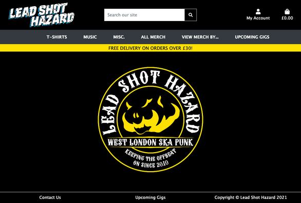
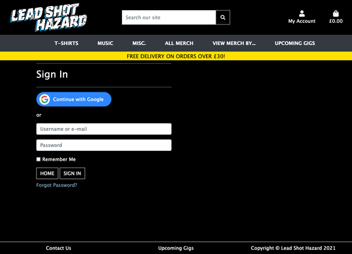
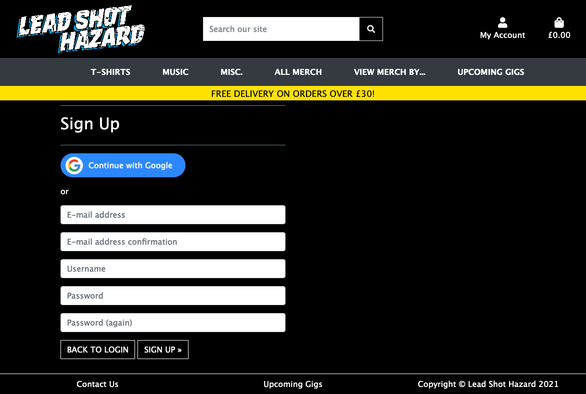
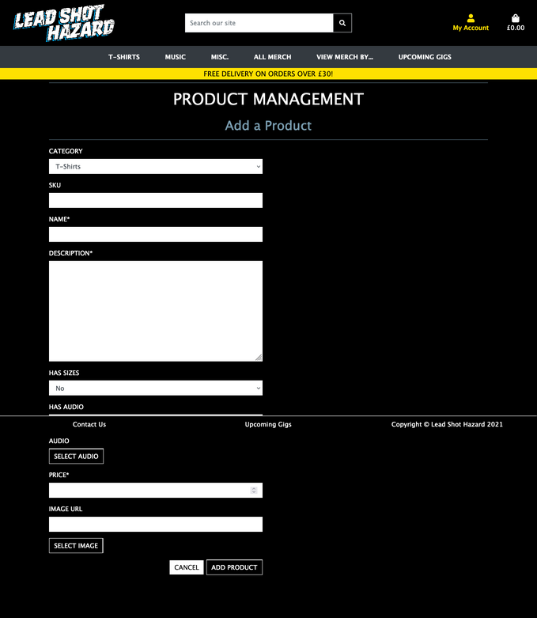
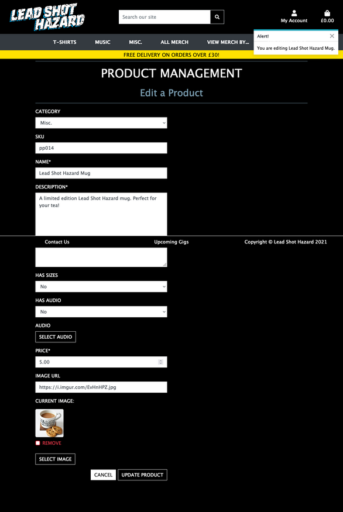

---

#### Safari

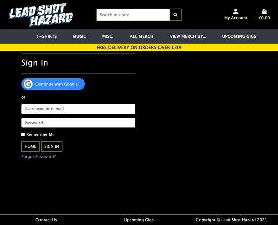
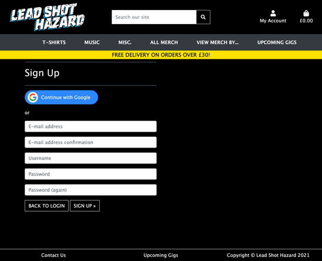
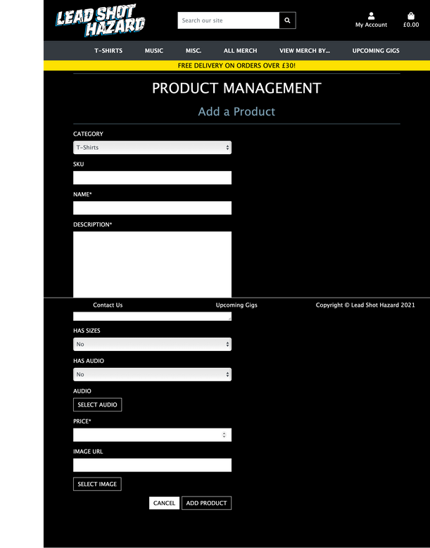

---

### Tablet
#### Safari

---

### Mobile
#### Chrome

---

#### Safari
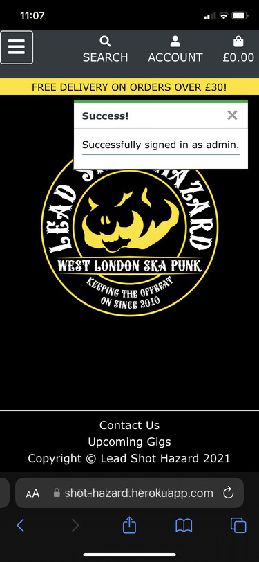

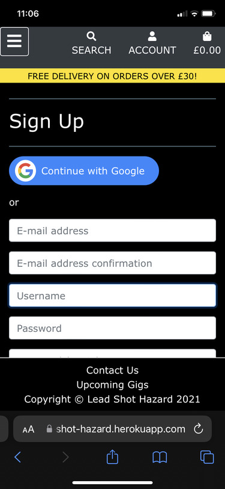

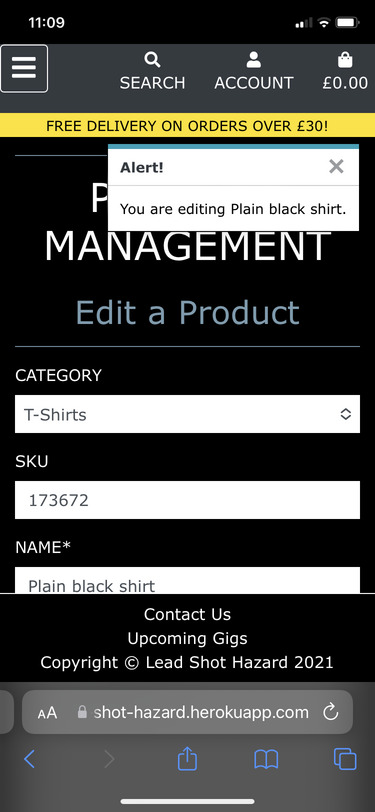

---

#### Samsung Internet

