# Testing Steps

[Click here to return to the main README file](README.md)

## Contents

* [Icon Key](#icon-key)

* [Automated Testing](#automated-testing)
  * [Django Testing](#django-testing)
  * [Travis CI](#travis-ci)

* [Manual Testing](#manual-testing)
  * [Devices and Browsers](#devices-and-browsers)
  * [Testing User Stories](#testing-user-stories)
  * [Testing Technologies](#testing-technologies)
  * [Links and Navigation](#links-and-navigation)
    * [Navigation Bar](#navigation-bar)
    * [Modals](#modals)
    * [External Links](#external-links)
  * [Styling and Layout](#styling-and-layout)

* [User Access](#user-access)

* [Functions](#functions)
  * [Register](#register)
  * [Log In](#log-in)
  * [Log Out](#log-out)
  * [Add Products](#add-products)
  * [Edit Products](#edit-products)
  * [Delete Products](#delete-products)
  * [Search Products](#search-products)
  * [Messages](#messages)
  * [Stripe](#stripe)
  * [404](#404)
  * [500](#500)
  * [Validation](#validation)

* [Database](#database)

* [Accessibility](#accessibility)
  * [Tap Targets](#tap-targets)
  * [Color Contrast](#color-contrast)
  * [Visually-Impaired Users](#visually-impaired-users)
  * [Assistive Technologies](#assistive-technologies)
  * [Reading Level](#reading-level)

* [Site Performance and Optimisation](#site-performance-and-optimisation)
  * [Lighthouse](#lighthouse)
  * [WebPageTest](#webpagetest)

* [Responsive Design](#responsive-design)
  * [Mobile Testing](#mobile-testing)
  * [Tablet Testing](#tablet-testing)
  * [Computer Testing](#computer-testing)

* [Images](#images)
  * [Desktop and Laptop Screenshots](#desktop-and-laptop-screenshots)
  * [Tablet Screenshots](#tablet-screenshots)
  * [Mobile Screenshots](#mobile-screenshots)

---

## Icon key

&#128272; <-- Superuser only access

&#128100; <-- Logged In Only

&#128683; <-- Logged Out only

[Back to the top](#testing-steps)

---

## Automated Testing

Automated Unit Testing was done using [Django’s testing tools](https://docs.djangoproject.com/en/3.2/topics/testing/) and [Travis CI](https://www.travis-ci.com/)'s continuous integration testing functionality.

### Django Testing

* Overall I was very happy with the level of coverage I got on this project.
* Some lines of code were omitted from coverage using `# pragma: no cover`, due to them either being code that's populated by Django, code in the settings.py file to connect to environment variables, or non-important code to the function of the site.
* [Click here to view the full testing coverage report](testing/automated/full-coverage.png).

#### Bag App

##### Bag Views

* Test the view_bag URL
* Test the add_to_bag URL
* Test that the add_to_bag view adds a product to the shopping bag
* Test the adjust_bag URL
* Test the remove_from_bag URL
* Test the add_to_bag view
* Test that the add_to_bag view updates the quantity of an item if it already exists in the bag
* Test the adjust_bag view
* Test that the adjust_bag view removes the item when the quantity is less than 1
* Test the remove_from_bag view
* Test that the remove_from_bag view throws an error if something goes wrong

##### Bag Others

* Test that the delivery cost is calculated correctly
* Test that the calc_subtotal function works

#### Band App

##### Band Views

* Test that the Contact Us page URL exists
* Test that the Contact Us page URL is accessible by name
* Test that the Contact Us page uses the correct template
* Test that the Upcoming Gigs page URL exists
* Test that the Upcoming Gigs page URL is accessible by name
* Test that the Upcoming Gigs page uses the correct template

#### Checkout App

##### Checkout Forms

* Test that full name is required
* Test that email is required
* Test that phone_number is required
* Test that country is required
* Test that town_or_city is required
* Test that street_address1 is required
* Test that the form fields are correct in the meta class

##### Checkout Models

* Test that the order string method returns the order number
* Test the checkout_details model
* Test the update_total model
* Test that the OrderLineItem string method returns the correct string

##### Checkout Views

* Test the cache_checkout_data view
* Test that the Checkout page URL exists
* Test that the Checkout page URL is accessible by name
* Test that the Checkout page uses the correct template
* Test that an error displays when there is nothing in the shopping bag
* Test that an error displays when the Stripe key isn't set
* Test the get in the checkout view
* Test that the user's details are auto-filled if the user is logged in and has saved information

#### Home App

##### Home Views

* Test that the Home page URL exists
* Test that the Home page URL is accessible by name
* Test that the Home page uses the correct template

#### Products

##### Products Models

* Test the product name
* Test the product description
* Test the product has_sizes
* Test the category name
* Test the category friendly_name

##### Products Views

* Test that the Products page URL exists
* Test that the Products page URL is accessible by name
* Test that the Products page uses the correct template
* Test the products page view
* Test the categories view
* Test the product_detail view
* Test that the product detail page URL exists
* Test the product sort functionality
* Test the product search functionality
* Test the product search error message shows correctly
* Test that a regular user cannot access the add a product page
* Test that the add a product page displays for a superuser
* Test that a regular user cannot access the edit a product page
* Test that the edit a product page displays for a superuser
* Test that a regular user cannot access the delete a product view
* Test that the delete a product view works for a superuser

#### Profiles

##### Profiles Forms

* Test that the user profile form fields aren't required
* Test the meta class of the user profile form

##### Profiles Models

* Test the getting user profile model

##### Profiles Views

* Test that the Profiles page URL exists
* Test that the Profiles page URL is accessible by name
* Test that a logged-in user can view the profile
* Test that the profile information gets saved correctly
* Test that the order history displays when requested

#### Omitted Code

* The main `manage.py` file has been omitted, as this is all required for the site to run.
* The Bag App `contexts.py` file has a few lines of omitted code, as these are either from the Code Institute Boutique Ado walkthrough, or are simply defining variables.
* The Band App `test_views.py` file has been omitted, as this is just testing code.
* The Checkout App `update_total`, `__str__()` and `save` functions have been omitted, as these are taken from the Code Institute Boutique Ado walkthrough.
* The Checkout App `signals.py` file has been omitted, as this sets up the basic update functionality that is used in other files, which is clear to be working because other functions wouldn't work without it.
* The Checkout App `test_models.py` file has been omitted, as this is just testing code.
* The Checkout App `cache_checkout_data` function has been omitted, as this Code is from the Code Institute Boutique Ado walkthrough and Stripe.
* The Checkout App `webhook_handler.py` and `webhooks.py` files have been omitted, as this Code is from the Code Institute Boutique Ado walkthrough and Stripe.
* The Products App `__init__()` function has been omitted, as this code is not necessary to the functionality of the site.
* One line in the Profiles App `__init__()` function has been omitted, as this code is not necessary to the functionality of the site.
* The Profiles App `models.py` still has one line of omitted code - the `__str__()` function. I could not find a place where this function was called across the site.
* Various lines from the `settings.py` file have been omitted, as these set the variables for use throughout the site, and do not require testing.

### Travis CI

[Click here to view the Travis CI full report](testing/automated/travis.png)

---

## Manual Testing

### Devices and Browsers

#### Desktop / Laptop

1. Google Chrome
    * All tested and working correctly.

2. Microsoft Edge
    * All tested and working correctly.

3. Mozilla Firefox
    * All tested and working correctly.

4. Safari
    * All tested and working correctly.

#### Tablet

1. Safari
    * All tested and working correctly.

#### Mobile

1. Google Chrome
    * All tested and working correctly.

2. Safari
    * All tested and working correctly.

3. Samsung Internet
    * All tested and working correctly.

#### Full devices and browsers

* The website was tested on Google Chrome, Mozilla Firefox, Microsoft Edge, Safari, and Samsung Internet browsers.
* Testing was not done on Internet Explorer due to it being deprecated in favour of Microsoft Edge.
* The website was viewed on a variety of devices, including:
  * Custom built desktop PC, running Windows 10
  * Acer Aspire V Nitro Laptop, running Windows 10
  * Lenovo B51 IntelCore i7 Laptop, running Ubuntu 16.04 LTS
  * MacBook Air7,2 (13-inch, 2017)
  * MacBook Pro (15-inch, 2017), running macOS Big Sur
  * iPad 6,11 5th generation, running iOS 10.3
  * iPhone 7
  * iPhone X
  * iPhone 12
  * OPPO Find X2 Lite
  * OPPO Find X2
  * Samsung Galaxy A70
  * Samsung Galaxy S9
  * Samsung A20
  * Xbox One

A large amount of manual testing was done to ensure that all pages were displayed correctly at all screen sizes, and all functionality worked as it should. Friends, family members, and other developers were asked to review the site and documentation to point out any bugs and/or user experience issues that they came across.

Responsive design was tested from 320px to 2500px, to account for the smallest of mobile devices, and the largest of monitors that the general public would be using.

[Back to the top](#testing-steps)

---

### Testing User Stories

| **User Story Id** | **User Story Statement** | **Testing** |
| --- | --- | --- |
|| **Overall** ||
| A1 | Band member - Sell merchandise and music - Have an online form of income | This site provides a secure method for the band to earn money from their merchandise sales |
| A2 | Band member - Match the design and personality of the band with that of the site - Easily show fans that this site is linked to the band | The color scheme and images have been directly taken from the band's artwork |
| A3 | Band member - Offer a website that is easy to navigate and free of confusion - Avoid the stress of fans needing more assistance than necessary | Every page has the full navigation bar across the top of the page. For long pages, there is a 'Back to top' button to help the user easily get back to the top. |
| A4 | Band member - Have another source of revenue for the band - Spend more time making music | Currently the band is only able to sell merchandise at gigs, or via their Bandcamp page. This site provides a dedicated site to sell all merchandise. This can be linked to from all social media platforms, to allow easy online sales. This means that the band can be earning money from merchandise sales whilst not actively gigging. |
| A5 | Band member - Have a platform where fans can follow the future gigs of the band - Ensure our fans know when and where our upcoming gigs are | All future gigs will be updated onto the site. This will be collated on the 'Gigs' page, which is available in the footer. |
|| **Viewing & Navigation** ||
| B1 | Shopper - Easily navigate the site - Have a good user experience | Every page has the full navigation bar across the top of the page. For long pages, there is a 'Back to top' button to help the user easily get back to the top. Everything is clearly laid out. All buttons describe what they're for in simple terms. Icons are used to help convey meaning. |
| B2 | Shopper - View all products - Choose some to buy | The user can scroll through all available merch via a link in the navigation bar. |
| B3 | Shopper - Search for a specific product and its information - Find the item that I want | There is a search bar at the top of all pages, so the user can search by product name or description from anywhere on the site. |
| B4 | Shopper - View a specific type of product - Quickly find items I'm interested in | There is a categories navigation bar at the top of all pages, so the user can quickly search by category from anywhere on the site. |
| B5 | Shopper - View full product information - See the details of a specific product including price, description, image, and sizes | A user can click on any product to view the full product information. |
| B6 | Shopper - Easily see my bag total - Stick to a budget | Every time the shopping bag is updated, a preview is shown in a message in the top right of the screen, which displays the total at the bottom. The total is also visible on the shopping bag and checkout pages, and a warning message is shown by the 'Checkout Securely' button, including the grand total, so the user is never unsure of their total. |
| B7 | Shopper - Get visual feedback when an action on the site is completed - Easily see when an action has been completed | When any action is completed, a message will appear to inform the user of the action. A full list of actions and messages can be found below in [Messages](#messages). |
| B9 | Shopper - Contact the band through the website - Ask questions | A contact page is available in the footer. Users can fill in the form to send a message to the band. |
|| **Registration & User Accounts** ||
| C1 | Site User - Create an account for future purchases - View my order history or checkout quicker | The user can navigate to the Register page via the navigation bar, which is visible on every page. The registration process is clearly described, and all instructions are clear. It only requires a username, an email address, a password, and a confirmation of that password to register an account. The user then needs to verify their email address to gain full access to their account. The user can then view their order history, and save their details on their Profile. |
| C2 | Site User - Log In - Access my account | The Log In and Log Out button is visible in the navigation bar. The Log In and Log Out process is intuitive and simple to use. If the user is logged out, the Log In button will show. |
| C3 | Site User - Log Out - Keep my account private on a shared device | The Log In and Log Out button is visible in the navigation bar. The Log In and Log Out process is intuitive and simple to use. If the user is logged in, the Log Out button will show. |
| C4 | Site User - Get an email confirmation after registering - Verify my registration was successful | Once a user has registered, they will be sent an email to confirm their email address. Once they have verified their email address, a message appears to confirm their email address is verified. |
| C5 | Site User - See a history of my previous purchases - Check what I have bought before | All previous purchases of an account are listed on the user's profile under 'Order History'. |
| C6 | Site User - Create, update or delete my personal information - Always have up-to-date personal information | Once a user has created an account, they can store their name, phone number, email address, and address details for faster checkout in the future. |
|| **Sorting & Searching** ||
| D1 | Shopper - Sort the available products - Sort alphabetically or by price | Just above the products on the Products page, the user has a dropdown box allowing them to select how they would like to sort the available products. |
| D2 | Shopper - Sort a category of products - Sort relevant products alphabetically or by price | Just above the products on the chosen category page, the user has a dropdown box allowing them to select how they would like to sort the available products. |
| D3 | Shopper - Search for a specific product and its information - Find the item that I want | There is a search bar at the top of all pages, so the user can search by product name or description from anywhere on the site. |
| D4 | Shopper - View a specific type of product - Quickly find items I'm interested in | There is a categories navigation bar at the top of all pages, so the user can quickly search by category from anywhere on the site. |
| D5 | Shopper - Easily see what I've searched, and the total number of results - Decide whether the product I'm looking for is available | At the top of the search page, the category the user has selected is displayed at the top. If the user has searched by name or description, the search term is visible at the top left, along with the total number of results. |
|| **Purchasing & Checkout** ||
| E1 | Shopper - Buy products online as a guest - Checkout without having to create an account | Registration to the site is not required to make a purchase. |
| E2 | Shopper - Easily add, update the quantity, or delete products in my bag - Adjust my purchase to fit my budget or personal choice | Products can be added to the shopping bag via any product details page. Products can be removed from the shopping bag via the Shopping Bag page, either by pressing the 'Remove' button under that item or by updating the quantity to 0. Multiples of the same item can be added to the shopping bag by updating the quantity field. This can be done on the product details page, or the shopping bag page. |
| E5 | Shopper - Receive an update of the shopping bag when I perform an action - Be aware of the status of my shopping bag | When any action is completed, a message will appear to inform the user of the action. This message will include a summary of the user's shopping bag. A full list of actions and messages can be found below in [Messages](#messages). |
| E4 | Shopper - View details about items in my bag - Decide if I want to purchase an item | All item details except description will display in the shopping bag. If the user wishes to view the item description again, they can click on the product in the shopping bag to return to that product's details page to view the description. |
| E4 | Shopper - Revisit my shopping bag after logging out and in - Continue my purchase | The user's shopping bag is stored until they checkout. If they log out and back in, the shopping bag will still be saved. |
| E6 | Shopper - Purchase products securely on the site - Be confident that my card and personal details are safe | Stripe is used to handle all card payments on this site. Stripe is certified to PCI Service Provider Level 1, which is the most stringent level of certification available in the payments industry. All card numbers are encrypted with AES-256 (Advanced Encryption Standard - 256 bits), and decryption keys are stored on separate machines. |
| E2 | Shopper - Receive a confirmation email with information of my order - View my order details | Once an order has been paid for successfully, an email will be sent out with full order details. |
|| **Product Management** ||
| F1 | Site Owner - Edit any product - Update details of products | Only the superuser can edit an existing product. This can be done on any product details page. |
| F2 | Site Owner - Delete any product - Remove old products from the site | Only the superuser can delete an existing product. This can be done on any product details page. |
| F3 | Site Owner - Add a new product - Add new products to the site | Only the superuser can add a new product. This can be done on the Product Management page. |
|| **Authentication & Security** ||
| G1 | Site User - Verify my email address - Ensure my account is set up securely | Once a user has registered, they will be sent an email to confirm their email address. Once they have verified their email address, a message appears to confirm their email address is verified. The user's account will not be accessible until the user has verified their email address. |
| G2 | Site User - Be confident that my password is stored securely - Feel safe from malicious activity | Django and Google store all passwords securely, so that even the site owner will never see the user's password |
| G3 | Site Owner - Be confident of the security of the restricted pages - Feel safe from malicious activity | The superuser is set through Django, so there can only be one. If a logged-out user tried to access a restricted page, it directs them to the log in page. If a logged-in user without access rights tries to access a restricted page, it redirects them to the homepage and presents them with a message informing them of this. |

[Back to the top](#testing-steps)

---

### Testing technologies

* HTML was validated using [W3C HTML Markup Validator](https://validator.w3.org/).
* CSS was validated using [W3C Jigsaw CSS Validator](https://jigsaw.w3.org/css-validator/).
* JavaScript was validated using [JSHint](https://jshint.com/).
* Python was validated using [Flake8](https://flake8.pycqa.org/en/latest/).
* Responsive design was tested using a variety of devices, as listed above in [Full devices and browsers](#full-devices-and-browsers), as well as being tested with [Google Chrome's Lighthouse](https://developers.google.com/web/tools/lighthouse), [Am I Responsive Design](http://ami.responsivedesign.is/#), and [Responsinator](http://www.responsinator.com/).
* Accessibility was checked via [WebAim's W.A.V.E](https://wave.webaim.org/), [WebAIM's Contrast Checker](https://webaim.org/resources/contrastchecker/), and [Google Chrome's Lighthouse](https://developers.google.com/web/tools/lighthouse).
* [Toptal Color-Blind Filter](https://www.toptal.com/designers/colorfilter/) was used to check that the site was suitable for color-blind users, as well as manually testing it with my color-blind partner.
* Unit Testing was done using [Django’s testing tools](https://docs.djangoproject.com/en/3.2/topics/testing/) and [Travis CI](https://www.travis-ci.com/)'s continuous integration testing functionality.

1. W3C HTML Markup Validator
    * [Homepage](https://validator.w3.org/nu/?doc=https%3A%2F%2Fms4-lead-shot-hazard.herokuapp.com%2F)
    * [Products](https://validator.w3.org/nu/?doc=https%3A%2F%2Fms4-lead-shot-hazard.herokuapp.com%2Fproducts%2F)
    * [Product Details](https://validator.w3.org/nu/?doc=https%3A%2F%2Fms4-lead-shot-hazard.herokuapp.com%2Fproducts%2F2%2F)
    * [Shopping Bag](https://validator.w3.org/nu/?doc=https%3A%2F%2Fms4-lead-shot-hazard.herokuapp.com%2Fbag%2F)
    * [Checkout](https://validator.w3.org/nu/?doc=https%3A%2F%2Fms4-lead-shot-hazard.herokuapp.com%2Fcheckout%2F)
    * [Order Confirmation](https://validator.w3.org/nu/?doc=https%3A%2F%2Fms4-lead-shot-hazard.herokuapp.com%2Fcheckout%2Fcheckout_success%2FD4C0F37FA19D4F51B2D16392BCE55B7C)
    * [Contact Us](https://validator.w3.org/nu/?doc=https%3A%2F%2Fms4-lead-shot-hazard.herokuapp.com%2Fband%2Fcontact-us%2F)
    * [Upcoming Gigs](https://validator.w3.org/nu/?doc=https%3A%2F%2Fms4-lead-shot-hazard.herokuapp.com%2Fband%2Fgigs%2F)
    * Unfortunately, as it's not possible to log in using the Validator, it was only possible to test the pages available to a user who isn't logged in.

2. W3C CSS Validator
    * [Homepage](https://jigsaw.w3.org/css-validator/validator?uri=https%3A%2F%2Fms4-lead-shot-hazard.herokuapp.com%2F&profile=css3svg&usermedium=all&warning=1&vextwarning=&lang=en)
    * [Products](https://jigsaw.w3.org/css-validator/validator?uri=https%3A%2F%2Fms4-lead-shot-hazard.herokuapp.com%2Fproducts%2F&profile=css3svg&usermedium=all&warning=1&vextwarning=&lang=en)
    * [Product Details](https://jigsaw.w3.org/css-validator/validator?uri=https%3A%2F%2Fms4-lead-shot-hazard.herokuapp.com%2Fproducts%2F2%2F&profile=css3svg&usermedium=all&warning=1&vextwarning=&lang=en)
    * [Shopping Bag](https://jigsaw.w3.org/css-validator/validator?uri=https%3A%2F%2Fms4-lead-shot-hazard.herokuapp.com%2Fbag%2F&profile=css3svg&usermedium=all&warning=1&vextwarning=&lang=en)
    * [Checkout](https://jigsaw.w3.org/css-validator/validator?uri=https%3A%2F%2Fms4-lead-shot-hazard.herokuapp.com%2Fcheckout%2F&profile=css3svg&usermedium=all&warning=1&vextwarning=&lang=en)
    * [Order Confirmation](https://jigsaw.w3.org/css-validator/validator?uri=https%3A%2F%2Fms4-lead-shot-hazard.herokuapp.com%2Fcheckout%2Fcheckout_success%2FD4C0F37FA19D4F51B2D16392BCE55B7C&profile=css3svg&usermedium=all&warning=1&vextwarning=&lang=en)
    * [Contact Us](https://jigsaw.w3.org/css-validator/validator?uri=https%3A%2F%2Fms4-lead-shot-hazard.herokuapp.com%2Fband%2Fcontact-us%2F&profile=css3svg&usermedium=all&warning=1&vextwarning=&lang=en)
    * [Upcoming Gigs](https://jigsaw.w3.org/css-validator/validator?uri=https%3A%2F%2Fms4-lead-shot-hazard.herokuapp.com%2Fband%2Fgigs%2F&profile=css3svg&usermedium=all&warning=1&vextwarning=&lang=en)
    * Unfortunately, as it's not possible to log in using the Validator, it was only possible to test the pages available to a user who isn't logged in.

3. JSHint
    * [JSHint](https://jshint.com/)
    * The only comments from JSHint are about template literals, the `let` keyword, and the `$` from jQuery, all of which are JSHint making the developer aware that those features aren't available outside of ES6 and jQuery.
    * There are no JavaScript errors in this project.
    * Stripe payments
    * 
    * Social media icon hover functions
    * 
    * Delete modal
    * 
    * Country field functionality
    * 
    * Quantity input field
    * 

4. Flake8
    * [Flake8](https://pypi.org/project/flake8/)
    * `Class 'x' has no 'objects' member` and `Class 'UserProfile' has no 'DoesNotExist' member`:
        * These are just warnings from pylint. Django adds the `objects` and 'DoesNotExist' properties to all model classes, so the IDE isn't aware of this.
    * `Avoid using null=True on string-based fields such CharField`:
        * This error is there to avoid a field having two values if left blank - an empty string, and `null`. This would usually be a valid error, but because I need to allow empty values in forms, this is required, as the `null` parameter only affects database storage.
    * There are also several warnings being shown from the migrations files. These are acceptable to ignore, as they are created by Django, and [this issue has been marked as a 'won't fix'](https://code.djangoproject.com/ticket/30555) by the Django team.
    * [Click here to view the full Flake8 results](testing/validator/flake8.png)

[Back to the top](#testing-steps)

---

### Links and Navigation

On every device and browser listed above, I tested the following:

#### Navigation Bar

##### Logo Testing

* Click the Logo to take the user to the Home page from the Home page.
* Click the Logo to take the user to the Home page from the Products page.
* Click the Logo to take the user to the Home page from the Product Details page.
* Click the Logo to take the user to the Home page from the Shopping Bag page.
* Click the Logo to take the user to the Home page from the Checkout page.
* Click the Logo to take the user to the Home page from the Order Success page.
* &#128100; Click the Logo to take the user to the Home page from the Order Confirmation page.
* Click the Logo to take the user to the Home page from the Contact Us page.
* Click the Logo to take the user to the Home page from the Upcoming Gigs page.
* &#128100; Click the Logo to take the user to the Home page from the Profile page.
* &#128272; Click the Logo to take the user to the Home page from the Product Management page.
* &#128683; Click the Logo to take the user to the Home page from the Log In page.
* &#128683; Click the Logo to take the user to the Home page from the Register page.

##### Products Testing

* Click the All Merch button to take the user to the Products page from the Home page.
* Click the All Merch button to take the user to the Products page from the Products page.
* Click the All Merch button to take the user to the Products page from the Product Details page.
* Click the All Merch button to take the user to the Products page from the Shopping Bag page.
* Click the All Merch button to take the user to the Products page from the Checkout page.
* Click the All Merch button to take the user to the Products page from the Order Success page.
* &#128100; Click the All Merch button to take the user to the Products page from the Order Confirmation page.
* Click the All Merch button to take the user to the Products page from the Contact Us page.
* Click the All Merch button to take the user to the Products page from the Upcoming Gigs page.
* &#128100; Click the All Merch button to take the user to the Products page from the Profile page.
* &#128272; Click the All Merch button to take the user to the Products page from the Product Management page.
* &#128683; Click the All Merch button to take the user to the Products page from the Log In page.
* &#128683; Click the All Merch button to take the user to the Products page from the Register page.
* Click the Keep Shopping button to take the user to the Products page from the Shopping Bag page.
* Click the Keep Shopping button to take the user to the Products page from the Product Details page.

##### Product Details Testing

* Click the product card to take the user to the Product Details page for that product from the Products page.
* Click the product card to take the user to the Product Details page for that product from the T-Shirts Products page.
* Click the product card to take the user to the Product Details page for that product from the Music Products page.
* Click the product card to take the user to the Product Details page for that product from the Misc. Products page.
* Click the product card to take the user to the Product Details page for that product from the Product Search page.

##### Shopping Bag Testing

* Click the Shopping Bag icon to take the user to the Shopping Bag page from the Home page.
* Click the Shopping Bag icon to take the user to the Shopping Bag page from the Products page.
* Click the Shopping Bag icon to take the user to the Shopping Bag page from the Product Details page.
* Click the Shopping Bag icon to take the user to the Shopping Bag page from the Shopping Bag page.
* Click the Shopping Bag icon to take the user to the Shopping Bag page from the Checkout page.
* Click the Shopping Bag icon to take the user to the Shopping Bag page from the Order Success page.
* &#128100; Click the Shopping Bag icon to take the user to the Shopping Bag page from the Order Confirmation page.
* Click the Shopping Bag icon to take the user to the Shopping Bag page from the Contact Us page.
* Click the Shopping Bag icon to take the user to the Shopping Bag page from the Upcoming Gigs page.
* &#128100; Click the Shopping Bag icon to take the user to the Shopping Bag page from the Profile page.
* &#128272; Click the Shopping Bag icon to take the user to the Shopping Bag page from the Product Management page.
* &#128683; Click the Shopping Bag icon to take the user to the Shopping Bag page from the Log In page.
* &#128683; Click the Shopping Bag icon to take the user to the Shopping Bag page from the Register page.
* Click the Go To Secure Checkout button on the toast message to take the user to the Shopping Bag page from any page.
* Click the Adjust Bag button to take the user to the Shopping Bag page from the Checkout page.

##### Checkout Testing

* Click the Secure Checkout button to take the user to the Checkout page from the Shopping Bag page.

##### Order Success Testing

* Click the Complete Order button and complete a purchase successfully to take the user to the Order Success page from the Checkout page.

##### Order Confirmation Testing

* Click the Order number link for a past purchase to take the user to the Order Confirmation page from the Profile page.

##### Contact Us Testing

* Click the Contact Us button in the footer to take the user to the Contact Us page from the Home page.
* Click the Contact Us button in the footer to take the user to the Contact Us page from the Products page.
* Click the Contact Us button in the footer to take the user to the Contact Us page from the Product Details page.
* Click the Contact Us button in the footer to take the user to the Contact Us page from the Shopping Bag page.
* Click the Contact Us button in the footer to take the user to the Contact Us page from the Checkout page.
* Click the Contact Us button in the footer to take the user to the Contact Us page from the Order Success page.
* &#128100; Click the Contact Us button in the footer to take the user to the Contact Us page from the Order Confirmation page.
* Click the Contact Us button in the footer to take the user to the Contact Us page from the Contact Us page.
* Click the Contact Us button in the footer to take the user to the Contact Us page from the Upcoming Gigs page.
* &#128100; Click the Contact Us button in the footer to take the user to the Contact Us page from the Profile page.
* &#128272; Click the Contact Us button in the footer to take the user to the Contact Us page from the Product Management page.
* &#128683; Click the Contact Us button in the footer to take the user to the Contact Us page from the Log In page.
* &#128683; Click the Contact Us button in the footer to take the user to the Contact Us page from the Register page.

##### Upcoming Gigs Testing

* Click the Upcoming Gigs button in the footer to take the user to the Upcoming Gigs page from the Home page.
* Click the Upcoming Gigs button in the footer to take the user to the Upcoming Gigs page from the Products page.
* Click the Upcoming Gigs button in the footer to take the user to the Upcoming Gigs page from the Product Details page.
* Click the Upcoming Gigs button in the footer to take the user to the Upcoming Gigs page from the Shopping Bag page.
* Click the Upcoming Gigs button in the footer to take the user to the Upcoming Gigs page from the Checkout page.
* Click the Upcoming Gigs button in the footer to take the user to the Upcoming Gigs page from the Order Success page.
* &#128100; Click the Upcoming Gigs button in the footer to take the user to the Upcoming Gigs page from the Order Confirmation page.
* Click the Upcoming Gigs button in the footer to take the user to the Upcoming Gigs page from the Contact Us page.
* Click the Upcoming Gigs button in the footer to take the user to the Upcoming Gigs page from the Upcoming Gigs page.
* &#128100; Click the Upcoming Gigs button in the footer to take the user to the Upcoming Gigs page from the Profile page.
* &#128272; Click the Upcoming Gigs button in the footer to take the user to the Upcoming Gigs page from the Product Management page.
* &#128683; Click the Upcoming Gigs button in the footer to take the user to the Upcoming Gigs page from the Log In page.
* &#128683; Click the Upcoming Gigs button in the footer to take the user to the Upcoming Gigs page from the Register page.
* Click the Upcoming Gigs button in the main nav bar to take the user to the Upcoming Gigs page from the Home page.
* Click the Upcoming Gigs button in the main nav bar to take the user to the Upcoming Gigs page from the Products page.
* Click the Upcoming Gigs button in the main nav bar to take the user to the Upcoming Gigs page from the Product Details page.
* Click the Upcoming Gigs button in the main nav bar to take the user to the Upcoming Gigs page from the Shopping Bag page.
* Click the Upcoming Gigs button in the main nav bar to take the user to the Upcoming Gigs page from the Checkout page.
* Click the Upcoming Gigs button in the main nav bar to take the user to the Upcoming Gigs page from the Order Success page.
* &#128100; Click the Upcoming Gigs button in the main nav bar to take the user to the Upcoming Gigs page from the Order Confirmation page.
* Click the Upcoming Gigs button in the main nav bar to take the user to the Upcoming Gigs page from the Contact Us page.
* Click the Upcoming Gigs button in the main nav bar to take the user to the Upcoming Gigs page from the Upcoming Gigs page.
* &#128100; Click the Upcoming Gigs button in the main nav bar to take the user to the Upcoming Gigs page from the Profile page.
* &#128272; Click the Upcoming Gigs button in the main nav bar to take the user to the Upcoming Gigs page from the Product Management page.
* &#128683; Click the Upcoming Gigs button in the main nav bar to take the user to the Upcoming Gigs page from the Log In page.
* &#128683; Click the Upcoming Gigs button in the main nav bar to take the user to the Upcoming Gigs page from the Register page.

##### Profile Testing

* &#128100; Click the Profile button to take the user to the Profile page from the Home page.
* &#128100; Click the Profile button to take the user to the Profile page from the Products page.
* &#128100; Click the Profile button to take the user to the Profile page from the Product Details page.
* &#128100; Click the Profile button to take the user to the Profile page from the Shopping Bag page.
* &#128100; Click the Profile button to take the user to the Profile page from the Checkout page.
* &#128100; Click the Profile button to take the user to the Profile page from the Order Success page.
* &#128100; Click the Profile button to take the user to the Profile page from the Order Confirmation page.
* &#128100; Click the Profile button to take the user to the Profile page from the Contact Us page.
* &#128100; Click the Profile button to take the user to the Profile page from the Upcoming Gigs page.
* &#128100; Click the Profile button to take the user to the Profile page from the Profile page.
* &#128272; Click the Profile button to take the user to the Profile page from the Product Management page.

##### Product Management Testing

* &#128272; Click the Product Management button to take the user to the Product Management page from the Home page.
* &#128272; Click the Product Management button to take the user to the Product Management page from the Products page.
* &#128272; Click the Product Management button to take the user to the Product Management page from the Product Details page.
* &#128272; Click the Product Management button to take the user to the Product Management page from the Shopping Bag page.
* &#128272; Click the Product Management button to take the user to the Product Management page from the Checkout page.
* &#128272; Click the Product Management button to take the user to the Product Management page from the Order Success page.
* &#128272; Click the Product Management button to take the user to the Product Management page from the Order Confirmation page.
* &#128272; Click the Product Management button to take the user to the Product Management page from the Contact Us page.
* &#128272; Click the Product Management button to take the user to the Product Management page from the Upcoming Gigs page.
* &#128272; Click the Product Management button to take the user to the Product Management page from the Profile page.
* &#128272; Click the Product Management button to take the user to the Product Management page from the Product Management page.

##### Edit / Delete Product Testing

* &#128272; Click the Edit button to take the user to the Edit Product page from the main Products page.
* &#128272; Click the Edit button to take the user to the Edit Product page from the Product Details page.
* &#128272; Click the Delete button to open the Delete modal from the main Products page.
* &#128272; Click the Delete button to open the Delete modal from the Product Details page.
* &#128272; Click the Delete button on the Delete modal from the main Products page to delete the product.
* &#128272; Click the Delete button on the Delete modal from the Product Details page to delete the product.

##### Log Out Testing

* &#128100; Click the Log Out button to log the user out and take them to the Home page from the Home page.
* &#128100; Click the Log Out button to log the user out and take them to the Home page from the Products page.
* &#128100; Click the Log Out button to log the user out and take them to the Home page from the Product Details page.
* &#128100; Click the Log Out button to log the user out and take them to the Home page from the Shopping Bag page.
* &#128100; Click the Log Out button to log the user out and take them to the Home page from the Checkout page.
* &#128100; Click the Log Out button to log the user out and take them to the Home page from the Order Success page.
* &#128100; Click the Log Out button to log the user out and take them to the Home page from the Contact Us page.
* &#128100; Click the Log Out button to log the user out and take them to the Home page from the Upcoming Gigs page.
* &#128100; Click the Log Out button to log the user out and take them to the Home page from the Profile page.
* &#128272; Click the Log Out button to log the user out and take them to the Home page from the Product Management page.

##### Log In Testing

* &#128683; Click the Log In button to take the user to the Log In page from the Home page.
* &#128683; Click the Log In button to take the user to the Log In page from the Register page.
* &#128683; Click the Log In button to take the user to the Log In page from the Product Details page.
* &#128683; Click the Log In button to take the user to the Log In page from the Shopping Bag page.
* &#128683; Click the Log In button to take the user to the Log In page from the Checkout page.
* &#128683; Click the Log In button to take the user to the Log In page from the Order Success page.
* &#128683; Click the Log In button to take the user to the Log In page from the Contact Us page.
* &#128683; Click the Log In button to take the user to the Log In page from the Upcoming Gigs page.
* &#128683; Click the Log In button to take the user to the Log In page from the Log In page.

##### Register Testing

* &#128683; Click the Register button to take the user to the Register page from the Home page.
* &#128683; Click the Register button to take the user to the Register page from the Register page.
* &#128683; Click the Register button to take the user to the Register page from the Product Details page.
* &#128683; Click the Register button to take the user to the Register page from the Shopping Bag page.
* &#128683; Click the Register button to take the user to the Register page from the Checkout page.
* &#128683; Click the Register button to take the user to the Register page from the Order Success page.
* &#128683; Click the Register button to take the user to the Register page from the Contact Us page.
* &#128683; Click the Register button to take the user to the Register page from the Upcoming Gigs page.
* &#128683; Click the Register button to take the user to the Register page from the Log In page.

[Back to the top](#testing-steps)

---

#### Modals

* &#128272; The Delete modal is visible in front of all other items on the screen, and clearly displays the Cancel and Delete buttons.
* &#128272; The Delete modal only deletes the specific product that it is related to.

[Back to the top](#testing-steps)

---

#### External Links

* The email icon opens up the user's email client with the Lead Shot Hazard email in the recipient line.
* The Facebook social media icon opens up the Lead Shot Hazard Facebook page in a new tab.
* The Bandcamp social media icon opens up the Lead Shot Hazard Bandcamp page in a new tab.
* The Instagram social media icon opens up the Lead Shot Hazard Instagram page in a new tab.
* The Twitter social media icon opens up the Lead Shot Hazard Twitter page in a new tab.
* The YouTube social media icon opens up the Lead Shot Hazard YouTube page in a new tab.
* The Spotify social media icon opens up the Lead Shot Hazard Spotify page in a new tab.
* The TikTok social media icon opens up the Lead Shot Hazard TikTok page in a new tab.
* The Soundcloud social media icon opens up the Lead Shot Hazard Soundcloud page in a new tab.

[Back to the top](#testing-steps)

---

### Styling and Layout

* Ensure all images load correctly.
* Ensure all images are correctly sized, and the correct aspect ratio is maintained.
* Ensure all grid layouts size correctly on all screen sizes.
* Ensure all modals appear in front of all other content on the screen.
* When hovered over the navbar links turn a dark grey color.
* When hovered over, other links turn Lead Shot Hazard yellow.
* When hovered over, the email icon and related text turn yellow.
* When hovered over, the Facebook social media icon and related text turn blue.
* When hovered over, the Bandcamp social media icon and related text turn blue.
* When hovered over, the Instagram social media icon and related text turn pink.
* When hovered over, the Twitter social media icon and related text turn blue.
* When hovered over, the YouTube social media icon and related text turn red.
* When hovered over, the Spotify social media icon and related text turn green.
* When hovered over, the TikTok social media icon and related text turn light blue.
* When hovered over, the Soundcloud social media icon and related text turn orange.

[Back to the top](#testing-steps)

---

## User Access

### Logged Out Users

* &#128683; Navigation bar dropdown shows Log In, Register.

### Logged In Users

* &#128100; Navigation bar dropdown shows Profile, Log Out.

### Admin Users

* &#128272; Navigation bar dropdown shows Profile, Product Management, Log Out.

[Back to the top](#testing-steps)

---

## Functions

### Register

* &#128683;
* Creates a new user account.
* Confirm password field is checked against password field to ensure no typos are made.
* Confirm email field is checked against email field to ensure no typos are made.
* If the username already exists, it informs the user and clears the form.
* If the passwords don't match, the user is informed.
* Google Social Register takes the user to sign up via Google.

### Log In

* &#128683;
* Logs the user into their existing account.
* Checks their password entry against the stored password for their user.
* If either username or password don't match what's in the database, it returns a message.
* Google Social Sign In takes the user to sign in via Google.

### Log Out

* &#128100;
* Logs the user out of the current session user account.
* Removes all session data.

### Homepage

* &#128683;
* All products are displayed on this page.
* There is a search function, as explained below in [Search Products](#search-products).

### Profile

* &#128100;
* Only accessible for logged-in users.
* It allows users to view any order that they have made.
* It allows users to edit their personal details.

### Add Products

* &#128272;
* Only accessible for the superuser.
* Provides a form for the superuser to fill in, with placeholder text.
* All input elements have the correct validation.
* Once submitted, it adds an item into the database, which then populates it onto the site.

### Edit Products

* &#128272;
* Only accessible for the superuser.
* Provides a form for the superuser to fill in, with placeholder text.
* All input elements have the correct validation.
* The form is pre-filled in with the current item details, for easy editing.
* Once submitted, it edits the item in the database, which then populates those edits onto the site.

### Delete Products

* &#128272;
* Only accessible for the superuser.
* Creates a modal to confirm if the superuser wishes to delete this item.
* Once submitted, it deletes the item from the database, so the item can no longer be viewed on the site.
* The item will be permanently deleted from the database.

### Search Products

* Accessible by all users.
* Searches through the database for what the user has entered into the search box.
* It uses the product name and description to search within.
* It returns all results.
* It populates a message if there are no results.
* It displays the search term that the user has searched for.
* It displays the total number of items returned under that search query.

### Messages

* &#128272; If products are added to the database, the phrase '{Item} Successfully Added' should display.
* &#128272; If products are deleted from the database, the phrase '{Item} Successfully Deleted' should display.
* &#128272; If products are edited in the database, the phrase '{Item} Successfully Updated' should display.
* If a product is added to the user's shopping bag, the phrase '{Item} successfully added to your bag' should display, with a summary of the user's shopping bag.
* If a product is removed from the user's shopping bag, the phrase '{Item} successfully removed from your bag' should display, with a summary of the user's shopping bag.
* If a product quantity is updated in the user's shopping bag, the phrase '{Item} quantity successfully updated to {quantity}' should display, with a summary of the user's shopping bag.
* &#128100; If a logged-in user without access rights tries to access a restricted page, it redirects them to the homepage, and presents them with a message saying 'You do not have access to this page'.

### Stripe

* To test the webhooks and payment process, I used the following Stripe testing card numbers:
  * No authentication required, successful payment: 4242 4242 4242 4242
  * Failed payment: 4000 0000 0000 9995
  * Authentication required: 4000 0025 0000 3155
  * Any expiry date in the future, 3-digit CVC code, and 5-digit ZIP code can be used.
* The no authentication required, successful card was run, didn't ask for authentication, and successfully paid.
* The failed payment card was run and the card payment failed.
* The authentication required card was run, asked for authentication, was given authentication, and successfully paid.
* The authentication required card was run, asked for authentication, was not given authentication, and failed.
* After each payment event, a message was shown to the user to explain the action that had just happened.
* After a successful payment, the user is then redirected to the Order Success page.

### 404

* Accessible by all users
* This page will display if a user has tried to access a page that doesn't exist, or if a user doesn't have access to the page they're trying to reach.
* It states clearly that it's a 404 error, and that the page does not exist.
* It directs the user to click the button to continue back to the safety of the site.
* The navigation bar is also available for the user to navigate back to the main site.

### 500

* Accessible by all users
* This page will display if an internal server error occurs.
* It states clearly that it's a 500 error, and that something went wrong.
* It directs the user to click the button to continue back to the safety of the site.
* The navigation bar is also available for the user to navigate back to the main site.

### Validation

* Form validation
  * This has been used on every form input on the site to ensure the correct data is added.
  * If incorrect data is added, red warning text appears, to instruct the user on how to fix the error.
* Adding products to the bag
  * Custom validation has been added to ensure that users can't:
    * Add less than one of a product into their bag (such as adding a 0 quantity of a product).
    * Add more than 50 of a product into their bag.
* Password validation
  * When a user is registering for an account, the site ensures no typos happen by prompting the user to enter the password twice, with the site checking to confirm that the passwords match.
* Email validation
  * When a user is registering for an account, the site ensures the correct email address has been entered by sending a verification email to the email address the user has supplied.
  * The account cannot be used until the user has verified that their email address is correct by following the link in the validation email.
* Image validation
  * A default image will display if there is no image added.
  * A default image will display if the image link has broken.
* Page validation
  * A custom 404 error page will show if the user attempts to visit a page that doesn't exist.
* Webhook validation
  * Webhooks form a notification system for every secure action on your site.
  * Webhooks return an event object, containing all the relevant information about the action, including the type of action, and the data associated with it.
  * If the user leaves the page before the order is complete but the payment goes through, the billing details and shipping address will be sent with the payment and can be accessed via webhooks.
* Login validation
  * If a logged-out user tries to access a restricted page, they will be redirected to the login page.
  * If a logged-in user without access rights tries to access a restricted page, it redirects them to the homepage, and presents them with a message saying 'You do not have access to this page'.

[Back to the top](#testing-steps)

---

## Database

* When the superuser adds products to the database, the information should be stored.
* When the superuser edits a product in the database, the information should be populated from the current product data into the form.
* When the superuser saves an edit to a product in the database, the information should be stored.
* When the superuser deletes a product from the database, the product should be permanently removed.
* If products are added to the database, the phrase '{Item} Successfully Added' should display.
* If products are deleted from the database, the phrase '{Item} Successfully Deleted' should display.
* If products are edited in the database, the phrase '{Item} Successfully Updated' should display.

[Back to the top](#testing-steps)

---

## Accessibility

### Tap Targets

* All tap targets are a minimum of 40px width and 40px height, to comply with WCAG Accessibility standards.
* All tap targets have a minimum of an 8px gap between them, to avoid any overlapping tap targets.

### Color Contrast

* All background and foreground colors have a sufficient contrast ratio.
* This site has been checked by a user with deuteranopia color blindness with no issues present.
* [Toptal Color-Blind Filter](https://www.toptal.com/designers/colorfilter/) was used to check every accessible page against every type of color-blindness, with no issues present. Unfortunately, the checker doesn't support logging in, so the logged-in-only pages were not able to be checked this way.
* All color contrasts were checked using [WebAIM's Contrast Checker](https://webaim.org/resources/contrastchecker/), with all large-scale text having a contrast ratio of at least 3:1, and all other text having a contrast ratio of at least 4.5:1.

### Visually-Impaired Users

* All images have meaningful alt text.
* All icons have an aria-label to describe them unless semantic text is also visible.
* All buttons that need more description for a visually-impaired user have an aria-labelledby attribute attached to them if required.

### Assistive Technologies

* All actions are keyboard-focusable.
* All interactable elements have hover and focus styling applied to them.
* All images have meaningful alt text for screen reader users.
* All icons have an aria-label to describe them unless semantic text is also visible.

### Reading Level

* All text content on the site has a maximum reading level of age 11 using the Automated Readability Index (ARI), to aid people with cognitive impairments, and people who don't speak English as a first language, among others.
* While this isn't ideal, as the recommended maximum reading level is age 9, given the site is for a ska punk band with swear words in their songs, I decided that this was an acceptable level to be at.
* All text content on this site has been tested against the ARI on [Readability Formulas](https://readabilityformulas.com/free-readability-formula-tests.php).
* The full report of all text on the site can be viewed in the [Readability Checker Results file](READABILITY.md).

[Back to the top](#testing-steps)

---

## Site Performance and Optimisation

Upon speaking to [Chris Anstey](https://github.com/ansteychris), a Digital Experience Lead at Google, he recommended testing with both Lighthouse and WebPageTest. Whilst they both test for the same things, Lighthouse often suffers from inaccurate readings for a wide variety of reasons. This ranges from how many browser tabs / windows you have open while you're doing the test, to how well your internet speed is performing that day. WebPageTest bypasses all of these issues, as it tests externally.

### Lighthouse

I tested my website using DevTools Lighthouse feature, and got these results:

#### Desktop Lighthouse

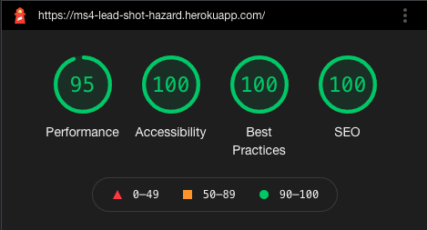

#### Mobile Lighthouse

#### Performance Lighthouse

* On mobile screens, this score was brought down due to the images not being of a set width and height. This is because I wanted the images to be fully responsive, so explicit width and height have not been set to achieve this.
* Besides this issue on mobile, I was happy with this score.

#### Accessibility Lighthouse

* I was very happy with this score.
* Please see the [Accessibility section](#accessibility) for full details of the steps I took to ensure this site was fully accessible.

#### Best Practices Lighthouse

* I was very happy with this score.
* All external links are secure.
* All images are displayed with the correct aspect ratio and resolution.
* There are no issues in the Devtools Issues panel.

#### SEO Lighthouse

* I was very happy with this score.
* All relevant meta tags were included.
* Each page has different meta tags, to relate to the page content.
* All links have descriptive text.

### WebPageTest

I tested my website using WebPageTest, and got these results:

* [WebPageTest Results](https://www.webpagetest.org/result/211025_BiDc17_4454be0499acb618820ee9541dd16b2a/)

[Back to the top](#testing-steps)

---

## Responsive Design

### Mobile Testing

* The Home page looks good and nothing wraps where it shouldn't or disappears off the edge of the viewport.
* The Products page looks good and nothing wraps where it shouldn't or disappears off the edge of the viewport.
* The Product Details page looks good and nothing wraps where it shouldn't or disappears off the edge of the viewport.
* The Shopping Bag page looks good and nothing wraps where it shouldn't or disappears off the edge of the viewport.
* The Checkout page looks good and nothing wraps where it shouldn't or disappears off the edge of the viewport.
* The Order Success page looks good and nothing wraps where it shouldn't or disappears off the edge of the viewport.
* The Order Confirmation page looks good and nothing wraps where it shouldn't or disappears off the edge of the viewport.
* The Contact Us page looks good and nothing wraps where it shouldn't or disappears off the edge of the viewport.
* The Upcoming Gigs page looks good and nothing wraps where it shouldn't or disappears off the edge of the viewport.
* The Profile page looks good and nothing wraps where it shouldn't or disappears off the edge of the viewport.
* The Product Management page looks good and nothing wraps where it shouldn't or disappears off the edge of the viewport.
* The Edit Product page looks good and nothing wraps where it shouldn't or disappears off the edge of the viewport.
* The Add Product page looks good and nothing wraps where it shouldn't or disappears off the edge of the viewport.
* The Login page looks good and nothing wraps where it shouldn't or disappears off the edge of the viewport.
* The Log Out page looks good and nothing wraps where it shouldn't or disappears off the edge of the viewport.
* The Register page looks good and nothing wraps where it shouldn't or disappears off the edge of the viewport.
* The Delete Product modal looks good, is placed in front of all other content, and nothing wraps where it shouldn't or disappears off the edge of the viewport.
* The buttons have well-sized text, not so big it takes up too much screen space, and not so small that they're difficult to read.
* All the font sizes aren't too big or too small for the screen size.
* All fonts are easy to read.
* All images are scaled to the screen size, whilst maintaining the correct aspect ratio.

### Tablet Testing

* The Home page looks good and nothing wraps where it shouldn't or disappears off the edge of the viewport.
* The Products page looks good and nothing wraps where it shouldn't or disappears off the edge of the viewport.
* The Product Details page looks good and nothing wraps where it shouldn't or disappears off the edge of the viewport.
* The Shopping Bag page looks good and nothing wraps where it shouldn't or disappears off the edge of the viewport.
* The Checkout page looks good and nothing wraps where it shouldn't or disappears off the edge of the viewport.
* The Order Success page looks good and nothing wraps where it shouldn't or disappears off the edge of the viewport.
* The Order Confirmation page looks good and nothing wraps where it shouldn't or disappears off the edge of the viewport.
* The Contact Us page looks good and nothing wraps where it shouldn't or disappears off the edge of the viewport.
* The Upcoming Gigs page looks good and nothing wraps where it shouldn't or disappears off the edge of the viewport.
* The Profile page looks good and nothing wraps where it shouldn't or disappears off the edge of the viewport.
* The Product Management page looks good and nothing wraps where it shouldn't or disappears off the edge of the viewport.
* The Edit Product page looks good and nothing wraps where it shouldn't or disappears off the edge of the viewport.
* The Add Product page looks good and nothing wraps where it shouldn't or disappears off the edge of the viewport.
* The Login page looks good and nothing wraps where it shouldn't or disappears off the edge of the viewport.
* The Log Out page looks good and nothing wraps where it shouldn't or disappears off the edge of the viewport.
* The Register page looks good and nothing wraps where it shouldn't or disappears off the edge of the viewport.
* The Delete Product modal looks good, is placed in front of all other content, and nothing wraps where it shouldn't or disappears off the edge of the viewport.
* The buttons have well-sized text, not so big it takes up too much screen space, and not so small that they're difficult to read.
* All the font sizes aren't too big or too small for the screen size.
* All fonts are easy to read.
* All images are scaled to the screen size, whilst maintaining the correct aspect ratio.

### Computer Testing

* The Home page looks good and nothing wraps where it shouldn't or disappears off the edge of the viewport.
* The Products page looks good and nothing wraps where it shouldn't or disappears off the edge of the viewport.
* The Product Details page looks good and nothing wraps where it shouldn't or disappears off the edge of the viewport.
* The Shopping Bag page looks good and nothing wraps where it shouldn't or disappears off the edge of the viewport.
* The Checkout page looks good and nothing wraps where it shouldn't or disappears off the edge of the viewport.
* The Order Success page looks good and nothing wraps where it shouldn't or disappears off the edge of the viewport.
* The Order Confirmation page looks good and nothing wraps where it shouldn't or disappears off the edge of the viewport.
* The Contact Us page looks good and nothing wraps where it shouldn't or disappears off the edge of the viewport.
* The Upcoming Gigs page looks good and nothing wraps where it shouldn't or disappears off the edge of the viewport.
* The Profile page looks good and nothing wraps where it shouldn't or disappears off the edge of the viewport.
* The Product Management page looks good and nothing wraps where it shouldn't or disappears off the edge of the viewport.
* The Edit Product page looks good and nothing wraps where it shouldn't or disappears off the edge of the viewport.
* The Add Product page looks good and nothing wraps where it shouldn't or disappears off the edge of the viewport.
* The Login page looks good and nothing wraps where it shouldn't or disappears off the edge of the viewport.
* The Log Out page looks good and nothing wraps where it shouldn't or disappears off the edge of the viewport.
* The Register page looks good and nothing wraps where it shouldn't or disappears off the edge of the viewport.
* The Delete Product modal looks good, is placed in front of all other content, and nothing wraps where it shouldn't or disappears off the edge of the viewport.
* The buttons have well-sized text, not so big it takes up too much screen space, and not so small that they're difficult to read.
* All the font sizes aren't too big or too small for the screen size.
* All fonts are easy to read.
* All images are scaled to the screen size, whilst maintaining the correct aspect ratio.

[Back to the top](#testing-steps)

---

## Images

In some of the images, the footer is hovering in the middle of the page content. This is an issue with the screenshotting tools on various browsers, rather than an issue with the site. Please disregard these issues, as they do not match the site itself.

### Desktop and Laptop Screenshots

#### Chrome Desktop Screenshots

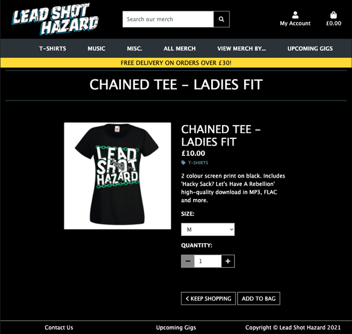

[Back to the top](#testing-steps)

---

#### Edge Desktop Screenshots

[Back to the top](#testing-steps)

---

#### Mozilla Firefox Desktop Screenshots

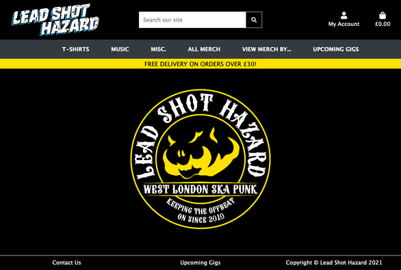

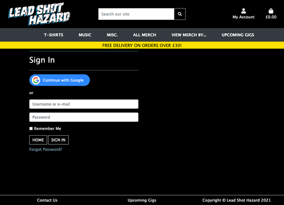

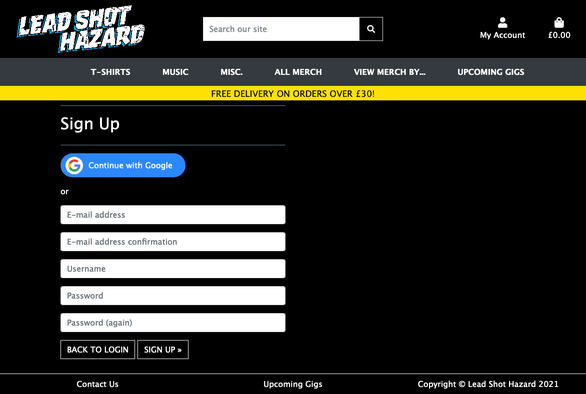

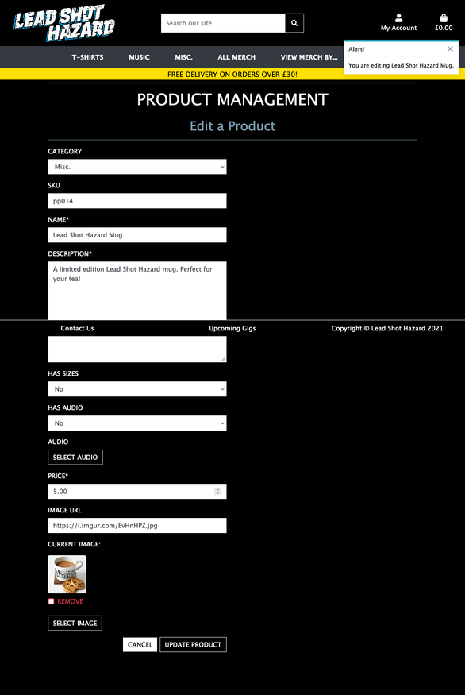

[Back to the top](#testing-steps)

---

#### Safari Desktop Screenshots

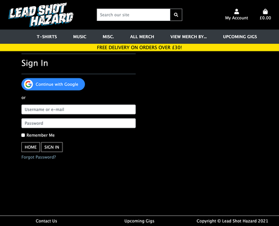

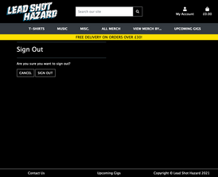

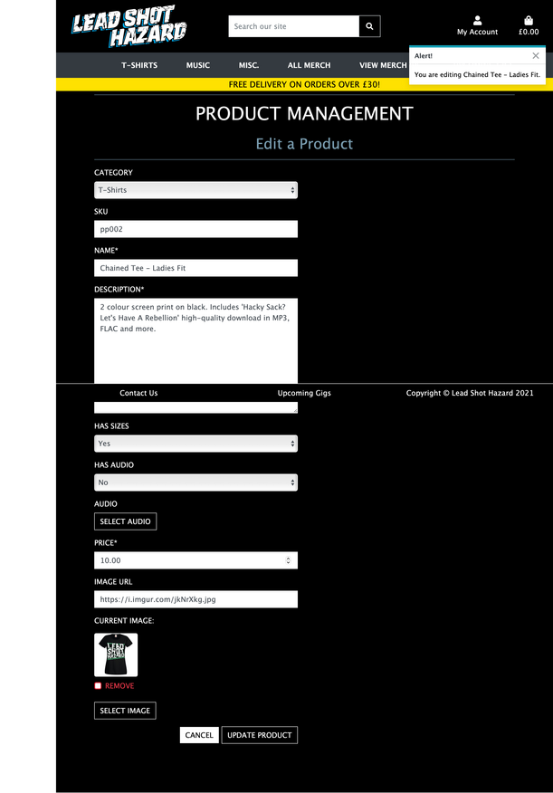

[Back to the top](#testing-steps)

---

### Tablet Screenshots

#### Safari Tablet Screenshots

[Back to the top](#testing-steps)

---

### Mobile Screenshots

#### Chrome Mobile Screenshots

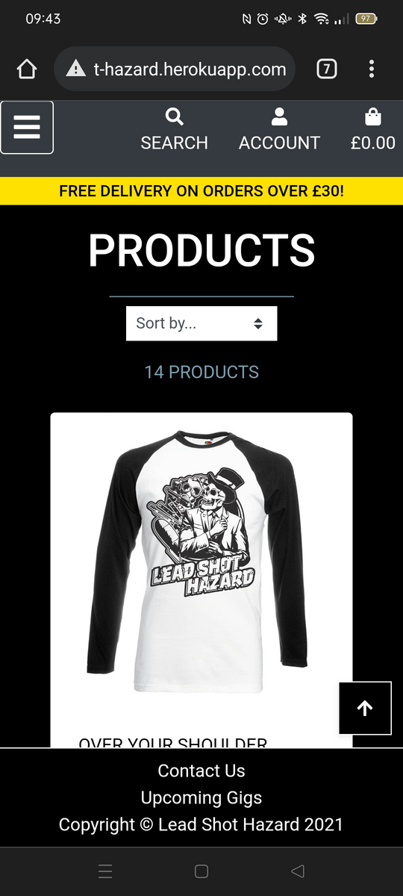

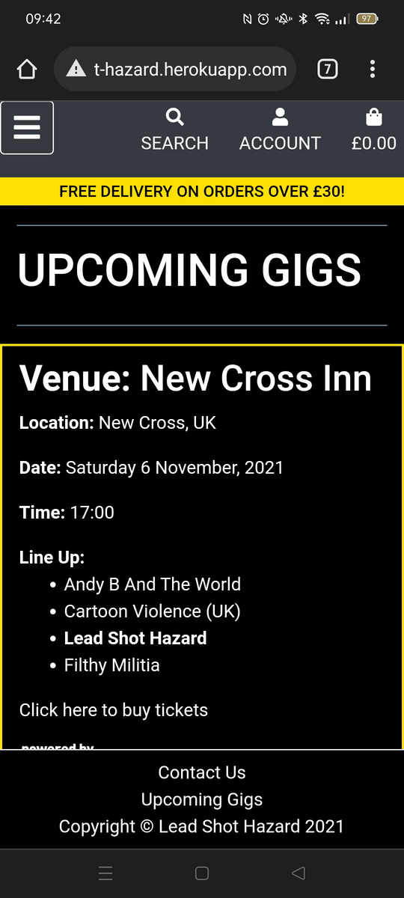

[Back to the top](#testing-steps)

---

#### Safari Mobile Screenshots

[Back to the top](#testing-steps)

---

#### Samsung Internet Mobile Screenshots

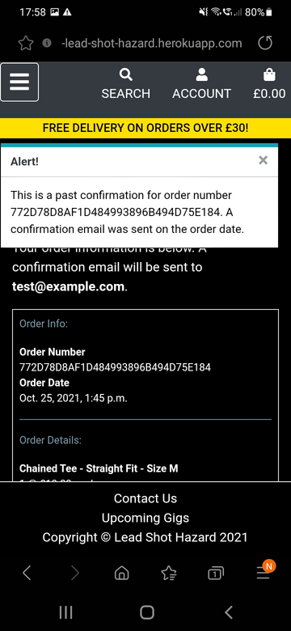

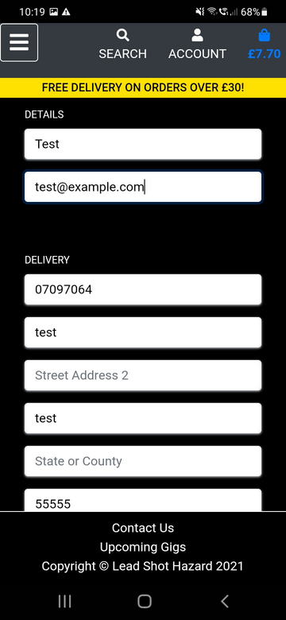

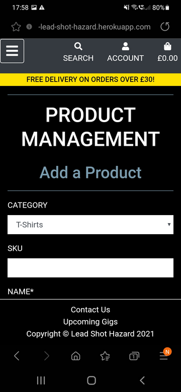

[Back to the top](#testing-steps)
